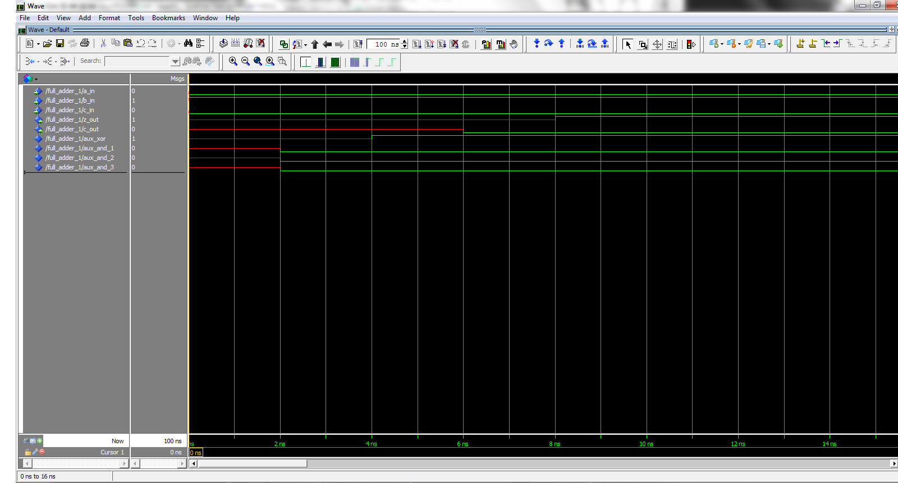
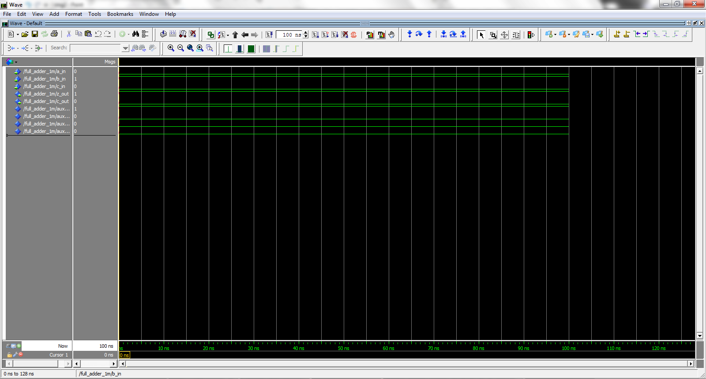
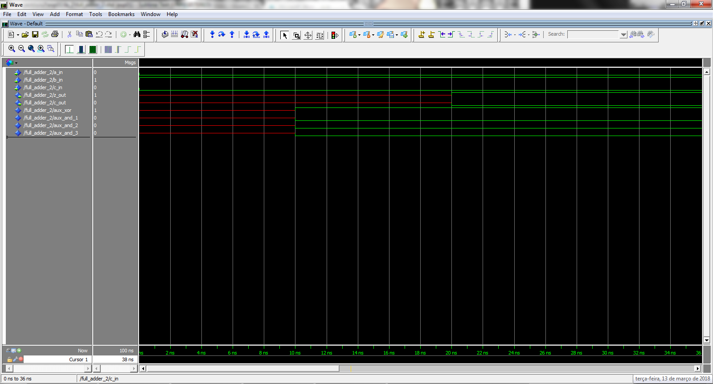
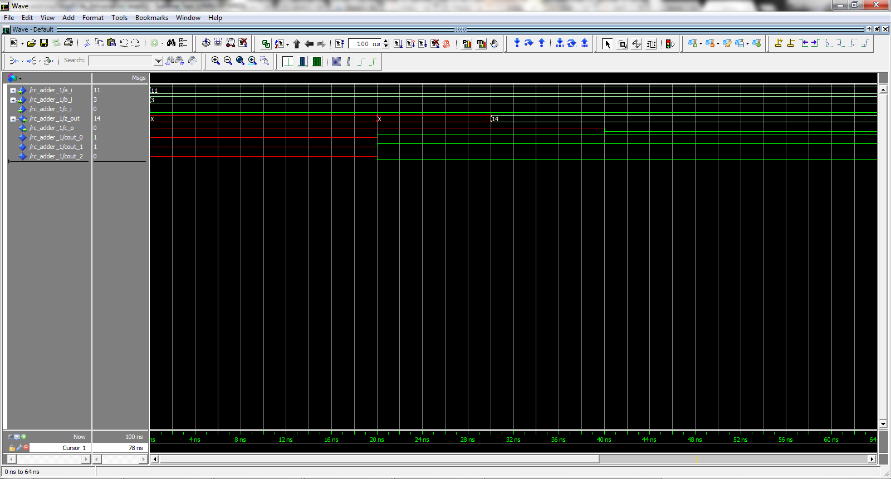
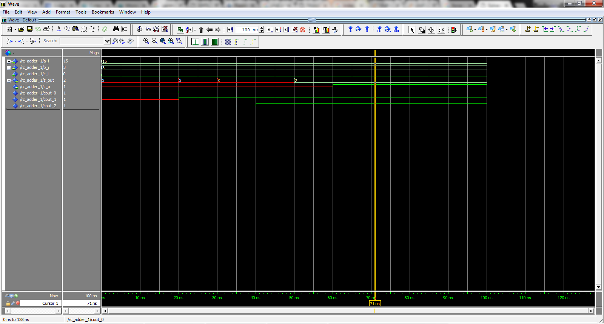

# PSI-3451 Projeto de CI Lógicos Integrados

Sejam bem-vindos ao laboratório do PSI. Esta primeira prática de VHDL pretende familiarizar o aluno com o software para simulação ModelSim. Através dele serão testadas diversas características da linguagem tais como tipos, entidades, processos e alguns comandos.

### Cuidados, observações e recomendações:

* Evite utilizar aplicativos do Windows quando estiver trabalhando nos ambientes (fazendo um projeto com o software da) Mentor Graphics ou Altera (fornecedores de CAD). A mesma recomendação vale também para o Linux. Usar, sempre que possível, os aplicativos associados às ferramentas de projeto.
* Todos os softwares utilizados são complexos. Nós procuramos nestas práticas dar ao aluno noções básicas sobre elas. Cabe ao próprio aluno, dado o seu interesse, explorar com maior profundidade o potencial das ferramentas de síntese e de simulação. Tutoriais, manuais, guias rápidos estão disponíveis geralmeste em *.pdf e *.html no help das ferramentas.
* Para fins de estudo após as aulas, salve todos os arquivos relevantes na sua área de trabalho da unidade de Rede (X:). Os arquivos salvos em unidades locais (C:) NÃO estarão disponíveis em outros computadores do laboratório.


## PARTE PRÁTICA

São fornecidos três (3) arquivos VHDL. Os 2 primeiros serão modificados durante a aula gerando outros 2 arquivos. No total serão analisados e simulados 5 arquivos VHDL. A seguir vamos descrever cada um dos modelos fornecidos e os conceitos de VHDL que podem ser observados em cada uma das simulações.

Em cada experimento e respectivo arquivo VHDL será submetido à seguinte sequência de tarefas: ***captura-compilação-simulação***.

O procedimento para ***capturar***, ***compilar*** e ***simular*** cada arquivo VHDL será explicado para o somador `full_adder_1`.

O mesmo procedimento deverá ser depois repetido para todas as demais simulações (desta aula e das próximas aulas em que for utilizado o programa ModelSim. Um arquivo com o roteiro é disponibilizado para facilitar futuras necessidades.

### Preparação das Pastas e Arquivos para Simulação

* Ligar o computador e entrar no ambiente Windows
* Utilizando o Windows Explorer acesse a sua área de trabalho na unidade de rede `X`.
* Na sua área de trabalho crie uma pasta `X:\psi3451` e dentro dela pastas onde serão armazenados os resultados das práticas. Uma **sugestão** é criar uma pasta para cada aula
(por exemplo, `aula_2` para esta prática), mas cada aluno deve usar a solução que julgar apropriada.
* Ainda com o Windows Explorer, selecione `Rede`=> `NEWSERVERLAB` => `psi3451` => `aula_2`. Copie todos os arquivos deste diretório para a sua pasta `X:\psi3451\aula_2`. São três arquivos *.vhd: `full_adder` (1 e 2) e `ripple_carry_1`.
* Como serão realizadas cindo (5) simulações recomendamos que sejam criadas pastas separadas para cada uma delas com o objetivo de salvar adequadamente os resultados. Por exemplo, crie as pastas:
    * `X:\psi3451\aula_2\fa_1`
    * `X:\psi3451\aula_2\fa_1m` (para o `full_adder_1` modificado)
    * `X:\psi3451\aula_2\fa_1`
    * `X:\psi3451\aula_2\fa_1m` (para o `full_adder_2` modificado)
    * `X:\psi3451\aula_2\rc_1`

Transfira cada um dos três arquivos VHDL copiados do serverlab para as três pastas correspondentes (sem a terminação m).

### 1) Captura e simulação do somador completo full_adder_1 (com atrasos inerciais)

***ATENÇÃO***: o procedimento apresentado a seguir, de CAPTURA, COMPILAÇÃO E SIMULAÇÃO do arquivo `full_adder_1` no programa ModelSim deverá ser seguido em todos os demais experimentos a serem realizados nesta e nas demais aulas práticas que terão como case a ferramenta ModelSim.

* Abra o arquivo `full_adder_1.vhd` (já salvo na sua pasta `X:\psi3451\aula_2\fa_1`) usando o NotePad++. Este somador está codificado no modelo VHDL *dataflow*. Analise o código da descrição tenha certeza de ter entendido todos os conceitos VHDL deste modelo:
    * Biblioteca `Library IEEE`
    * Comando `use IEEE.STD_LOGIC_1164.all`
    * Par `entity`/`architecture`
    * Declaração de sinais internos `signal` ...
    * Transferência de sinais `<=`
    * Tipo `STD_LOGIC`
    * Atraso inercial `after`. ***ATENÇÃO***: os atrasos anotados no modelo devem ser cuidadosamente observados e identificados durante as simulações.
    * A descrição arquitetural comparada às equações da apostila de conceitos.
* Clique no botão Iniciar (do Windows) e digite modelsim no campo de busca. Nas opções que surgirem, escolha **modelsim**. Isto disparará o software (***certifique-se que trata-se do modelsim se 10 ou 10.1d***).
* Feche a janela de boas vindas e de **release notes** do ***modelsim***, caso esta janela abra automaticamente.
* Observe inicialmente que há uma janela **Library** de bibliotecas VHDL (já com várias instaladas). Observe que na parte inferior do software existe a janela **Transcript**. Nela o usuário pode digitar comandos e verificar mensagens informativas e de erros sobre seus procedimentos.
* Para acessar os arquivos no diretório desejado, clique no menu File e em seguida em Change Directory. Selecione o caminho para o diretório criado para esta seção da prática (`X:\psi3451\aula_2\fa_1`). Observe que na janela **Transcript** aparece o comando `cd X:\psi3451\ aula_2\fa_1`. ***Observação***: Isto demonstra que é possível executar as mesmas operações teclando comandos em vez de se usar o menu.
* O comando `ls` seguido de enter permite listar os arquivos no diretório.
* É necessário criar uma biblioteca (subdiretório) de trabalho no contexto do Modelsim. Esta será denominada `work`. Selecione a opção **File** -> **New** -> **Library**. Na caixa de diálogo, selecione **new library and a logical mapping to it** e digite `work` em library name e `work` em **library physical name**. Novamente, observe o que acontece na janela **Transcript**.

**Pergunta**: qual é o comando-linha correspondente?

> Resposta: `vlib work` seguido de `vmap work work`

***Observação***: Na janela superior deve aparecer a biblioteca `work` listada junto com outras que já existiam (e que devem ser ignoradas no momento). A biblioteca `work` ainda deve estar vazia.

* Para ***compilar*** e ***importar*** arquivos VHDL para a biblioteca criada usa-se a opção de menu **Compile** seguido do submenu **Compile...**. Selecione o arquivo `full_adder_1.vhd` e clique no botão ***Compile***. Clique em ***Done***.

***Observação***: Devem aparecer na janela **Transcript** as mensagens a seguir, indicando a correta compilação sem erros:

```bash
# -- Compiling entity
# -- Compiling architecture
# Errors: 0, Warnings: 0
```

> OBS: no meu não apareceu isso. O que apareceu foi o seguinte:
> `# Model Technology ModelSim SE-64 vcom 10.1d Compiler 2012.11 Nov  1 2012`
> `# -- Loading package STANDARD`
> `# -- Loading package TEXTIO`
> `# -- Loading package std_logic_1164`
> `# -- Compiling entity full_adder_1`
> `# -- Compiling architecture dataflow of full_adder_1`

**Pergunta**: qual é o comando-linha correspondente?

> Resposta: `vcom -reportprogress 300 -work work X:/projects/cis2/exp01/fa_1/full_adder_1.vhd`

Neste momento é possível observar que o arquivo VHDL compilado aparece na biblioteca `work`. Clique no símbolo + que aparece ao lado da biblioteca `work` e em seguida no + que aparece ao lado do módulo de interesse. Aparecerá o nome da arquitetura (**dataflow**) do modelo VHDL importado.

Para realizar a simulação do modelo VHDL (após sua compilação e captura para a biblioteca `work`) seleciona-se a opção **Simulate** => **Start Simulation** no menu.

* Na caixa de diálogo, escolha a janela **Design**, expandindo a biblioteca work e selecionando a entidade `full_adder_1` (já compilada).
* Clique no botão **Optimization Options**. Será aberta uma janela com as opções de otimização onde modificaremos as opções de visibilidade (acesso) da simulação
* Selecione a aba **Visibility** => **Apply full visibility to all modules (full debug mode)** => **OK**. Carregue a simulação clicando novamente em **OK** na janela **Start Simulation**

**Pergunta**: qual é o comando-linha correspondente?

> Resposta: `vsim -gui -voptargs=+acc work.full_adder_1`

***Observação***: O **modelsim** sofrerá uma mudança no layout e onde estava a janela **Library**, deverão surgir duas abas chamadas **Sim** e **Library**. A primeira será um ambiente direcionado a este contexto de simulação. Deve também aparecer a janela **Wave** utilizada para visualizar os sinais de interesse.

* Na aba **Sim** selecione o módulo de interesse com um clique simples.
* Certifique-se de que todos objetos da entidade em questão estejam visíveis habilitando no menu **View** as janelas **Objects**, **Processes** e **Locals**.
* Clique em **Add** => **Wave** => **All items in region**. Todos os portos de entrada e saída do modelo VHDL serão transferidos para a janela **Wave** do simulador. No caso do full_adder os portos são:
    * `sim:/full_adder/a_in`
    * `sim:/full_adder/b_in`
    * `sim:/full_adder/c_in`
    * `sim:/full_adder/z_out`
    * `sim:/full_adder/c_out`

A partir deste momento, o simulador está pronto para receber os comandos referentes aos estímulos de entrada que se deseja observar (comando `force`) assim como ao avanço no tempo de simulação (comando `run`).

Por exemplo, o comando `run 100ns` avança o simulador este intervalo de tempo. Mas, observe que todos os sinais estão indeterminados pois não foram ainda especificados valores iniciais.

Por exemplo, os comandos:
```bash
force a_in 0
force b_in 1
force c_in 0
run 100ns
```
mostrarão o resultado da soma A+B+C = 0+1+0 = 1. ***Atenção***, os resultados também mostrarão os
atrasos codificados no modelo VHDL sendo simulado.

> Resultado:


Comandos semelhantes permitem observar outras combinações dos valores das entradas.

***Recomendação***: por se tratar de um circuito combinatório de apenas 3 entradas, realize a simulação testando a tabela da verdade completa (através dos comandos `force` / `run`) para certificar-se que o código está correto.

Caso se deseje reiniciar a simulação a partir do instante zero basta usar o comando `restart`.

Apesar de não ser necessário para o caso do `full_adder`, vamos ilustrar o formato do comando que cria estímulos periódicos (como é o caso de um `clock`, por exemplo, que será usado em diversos módulos sequenciais do projeto).

```bash
force -freeze a_in 1 0, 0 {10 ns} -r 20
```

Este comando cria um sinal `a_in` de período 20ns e transição em 10ns (50% de duty cicle).

**Pergunta**: como é o comportamento do circuito em termos de tempos de atraso? De que forma são as dependências entre as operações lógicas na descrição VHDL e como os atrasos são transmitidos?

> Resposta: podemos ver que os atrasos que foram definidos no código (`... AFTER 4 ns`) foram de fato incorporados à simulação devido ao atraso na progapação dos sinais ao longo dos "gates".

#### DICA: PARA FACILITAR AS PRÓXIMAS SIMULAÇÕES

É possível criar um *script* (arquivo de texto `xxx.tcl`) com todos os comandos-linha que se desejam repetir. Por exemplo, podem ser salvos no *script* todos os comando apresentados acima relativos à criação da biblioteca seguida da compilação do arquivo VHDL e seguida pelos comandos para a simulação do código ou, alternativamente, podem ser salvos somente os comandos usados durante a simulação do código. Para verificar todos os comandos que estão ativos na janela **Transcript** utilize o comando `history`.

Para criar o arquivo `xxx.tcl`, inicialmente certifique-se que a janela transcript contenha apenas a sequência de comandos desejada. Uma vez que a sequência de comandos esteja correta, ative a janela **Transcript** clicando com o ponteiro do mouse sobre qualquer lugar desta janela. Em seguida clique em **File** => **Save Transcript As** e na janela que aparece selecione a pasta em que deseja salvar os comandos e na janela apropriada escreva `nome_qualquer.tcl` e salve este arquivo. Caso precise, o aluno poderá editar diretamente o arquivo criado (é um arquivo texto) através de um editor de texto, apagando ou incluindo comandos.

Para ativar este script, com a janela **Wave** ativada (estando nela carregado os dados do novo circuito a ser simulado) clique em **File** => **Load**  => **Macro File** e selecione `nome_qualquer.tcl`. Isto irá disparar uma nova simulação com exatamente a sequência de comandos do *script*, evitando a necessidade de repetir cada comando do simulador na nova simulação.

### 2) Captura e simulação do somador completo full_adder_1 com atraso delta

* Faça uma cópia do arquivo `full_adder_1.vhd` e salve este novo arquivo com o nome `full_adder_1m.vhd` na pasta `X:\psi3451\aula_2\fa_1m`. No arquivo, mude o nome da instância (e em todos os pontos em que é usado) para `full_adder_1m`.
* Em seguida modifique o arquivo (com o programa WordPad) removendo todas as menções de atraso (`AFTER k ns`).

Conceitos VHDL deste modelo: atraso DELTA.

* Repita o procedimento de captura, compilação e simulação conforme descrito no item 1 acima.

Atenção: realize a simulação com a mesma sequência de combinações de valores de entrada (do comando `force`) da simulação da seção 1.

> Resultado:
```tcl
# Definindo o diretório do projeto
cd X:/projects/cis2/exp01/fa_1m
# Criando as libraries do projeto
vlib work
vmap work work
# Compilando o projeto
vcom -reportprogress 300 -work work X:/projects/cis2/exp01/fa_1m/full_adder_1m.vhd
# Modificando as opções de visualização do projeto
vsim -gui -voptargs=+acc work.full_adder_1m
# Configurando os sinais a serem apresentados
add wave -position insertpoint  \
sim:/full_adder_1m/a_in \
sim:/full_adder_1m/b_in \
sim:/full_adder_1m/c_in \
sim:/full_adder_1m/z_out \
sim:/full_adder_1m/c_out \
sim:/full_adder_1m/aux_xor \
sim:/full_adder_1m/aux_and_1 \
sim:/full_adder_1m/aux_and_2 \
sim:/full_adder_1m/aux_and_3
# Realizando simulação por 100ns
force a_in 0
force b_in 1
force c_in 0
run 100ns
```




**Pergunta**: como é o novo comportamento do circuito em termos de tempos de atraso? De que forma as dependências entre as operações lógicas na descrição influenciam os atrasos?

> Resposta: podemos ver que nessa simulação todos os estados quiescentes foram atingidos desde o início da simulação devido à inexistência de atrasos de propagação.

### 3) Captura e simulação do somador completo `full_adder_2` no modelo estrutural

* Abra o arquivo `full_adder_2.vhd` da pasta `X:\psi3451\aula_2\fa_2`. Ele está codificado no modelo VHDL estrutural (*structural*).
* Analise toda a descrição, linha a linha. Tenha certeza que tenha encontrado e entendido os itens seguintes:
    * a declaração de componentes
    * o modelo VHDL dataflow do AND2, XOR2 e OR3 (entity e architecture)
    * os parâmetros de tempo generic de cada um dos modelos acima e a sua utilização nas respectivas arquiteturas
    * o posicionamento de todas as declarações de bibliotecas e pacotes
    * as instanciações e os nomes das instâncias
    * port map e generic map
    * no port map, casos de associação implícita e explícita para os sinais
    * a correspondência do full adder com o esquemático apresentado na apostila de conceitos (verifique as conexões entre as instâncias do VHDL).
* Faça o procedimento de captura, compilação e simulação conforme descrito anteriormente.

***Recomendação***:: realize a simulação para verificar:

* o funcionamento do *full adder* (use vetores de teste iguais aos usados para o modelo *dataflow* nas seções anteriores)
* as diversas variações dos sinais internos e das saídas de acordo com a mudança dos valores dos sinais de entrada

Guarde os resultados do Wave para comparação.

> Resposta:
> Depois de executar o script `fa_2/script.tcl` obteve-se o seguinte resultado:
> 

**Perguntas**: seguindo as recomendações, a simulação mostrou o comportamento esperado do circuito como descrito na apostila de conceitos? Quais foram os tempos de atraso verificados para as portas lógicas? Foi o esperado? Por que?

> Resposta: Analisando a o sinal `aux_and_1` temos:
```VHDL
    AND_1: and2 GENERIC MAP (10 ns) PORT MAP (x => a_in,
                                              y => b_in,
                                              z => aux_and_1);
```
> portanto o atraso nesse sinal será igual ao definido no momento da instanciação do componente genérico, igual a 10[ns] (***está certo isso??????***), que é o que se observa no gráfico.
> O mesmo acontece com todos os outros sinais auxiliares e de saída. Sendo assim podemos dizer que o componente se comportou como previsto.

**Pergunta**: como se compara os resultados com os da seção 1?

> Resposta: aqui tivemos um atraso muito maior que no somadro `full_adder_1`, como era de se esperar.


### 4) Captura, compilação e simulação do somador no modelo estrutural com alterações nas instaciações (*generic*)

* Faça uma cópia do arquivo arquivo `full_adder_2.vhd` e salve-o com o nome `full_adder_2m.vhd` na pasta `X:\psi3451\aula_2\fa_2m`. No arquivo, mude o nome da instância (e em todos os pontos em que é usado) para `full_adder_2m`.
* Em seguida modifique o arquivo (com o programa **Notepad++**), retirando as instruções de `generic map` em todas as suas ocorrências nas instanciações (deixe apenas os `port map`).
* Repita o procedimento de captura, compilação e simulação do item 3)

**Pergunta**: quais foram os tempos de atraso verificados para as portas lógicas? Por que?

> Resposta: a simulação gerou o seguinte resultado:
> 
> Aqui podemos observar que os atrasos foram iguais aos definidos nas portas lógicas do projeto `and2` (2[ns]), `xor2` (4[ns]) e `or3` (4[ns]).

**Pergunta**: como se compara os resultados com os da seção 1?
> Resposta: o resultado foi semelhante ao da seção 1 pois os atrasos das portas lógicas é semelhante nos dois casos.

### 5) Projeto, captura, compilação e simulação do somador de 4 bits no modelo estrutural

* Abra o arquivo `rc_adder_1.vhd` para a pasta da `X:\psi3451\aula_2\rc_1`. Ele está codificado no modelo VHDL estrutural (`structural`). Observe que apenas a entidade (`entity`) está descrita. A arquitetura deverá ser preparada pelo(a) aluno(a).
* Analise a descrição da entity, linha a linha. Tenha certeza que tenha encontrado e entendido os itens seguintes:
    * o posicionamento de todas as declarações de bibliotecas e pacotes
    * a descrição dos vetores de entrada e saída array de bits
* Abra o arquivo arquivo `full_adder_2.vhd` e copie o seu conteúdo para o `rc_adder_1.vhd`, pois servirá como seu componente.
* Faça um esboço do *ripple-carry adder* com todos os seus sinais externos e internos.
* Faça a declaração do componente do `full_adder`.
* Seguindo o seu esboço, faça a declaração de todos os sinais internos. Use arrays se desejar.
* Instancie quatro (4) somadores completos, interligue-os bit-a-bit.
* Repita o procedimento de captura, compilação e simulação.

***Recomendação***: realize a simulação para verificar:

* o funcionamento do *ripple carry adder*
* teste vários casos de **propagação** de *carry-out* e de ocorrência de *overflow*

Guarde os resultados do Wave para futuras referências e comparações.

> Resultado: resultado da simulação de uma soma sem overflow:
> 

> Resultado: resultado da simulação de uma soma com overflow:
> 

**Pergunta**: quantos níveis de hierarquia há no seu projeto? Onde as bibliotecas foram declaradas?
> Resposta: nesse projeto temos 3 níveis de hierarquia: as portas lógias, os somadores e o somador ripple carry. Todos esses elementos foram declarados no mesmo arquivo.
