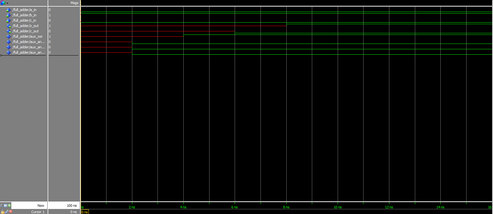
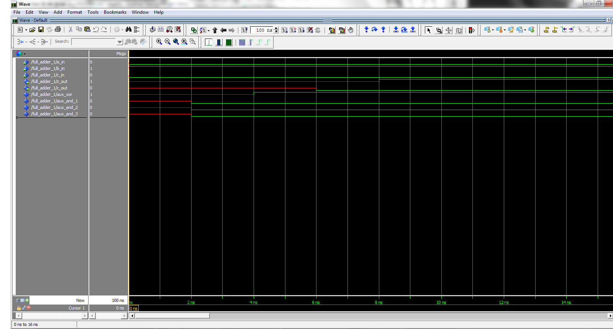
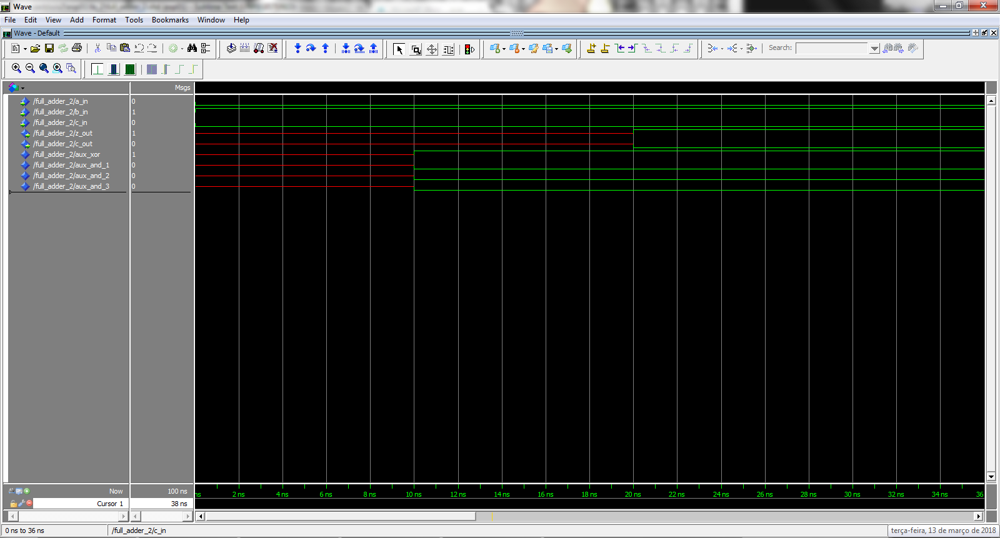

# PSI-3451 Projeto de CI Lógicos Integrados
# Luiz Sol - 8586861
# Experimento 2

Esta segunda prática de VHDL pretende colocar o aluno em contato com mais algumas estruturas sintáticas da linguagem. As mesmas recomendações dadas na apostila da aula 2 permanecem e solicitamos que todos revisitem a parte inicial daquele texto. Tenha certeza que sabe responder as perguntas listadas abaixo após a observação dos arquivos ou dos resultados de simulações.

## PARTE PRÁTICA

São fornecidos 6 arquivos VHDL. A partir destes serão gerados outros modelos através de pequenas modificações nos respectivos códigos VHDL. No total serão realizadas 12 simulações com o objetivo de exercitar alguns conceitos da linguagem VHDL.

A seguir vamos descrever cada um dos modelos fornecidos e os conceitos de VHDL que podem ser observados em cada uma das simulações.

Em cada experimento, o respectivo arquivo VHDL será submetido à seguinte sequência de tarefas: **captura-compilação-simulação**.

O procedimento para **capturar**, **compilar** e **simular** cada arquivo VHDL é o mesmo utilizado na Aula 2.

Utilize [o roteiro disponibilizado no site](https://edisciplinas.usp.br/pluginfile.php/4251725/mod_resource/content/1/roteiro%20geral%20para%20uso%20modelsim.pdf) para facilitar a sua tarefa.

### Preparação das Pastas e Arquivos para Simulação

* Ligar o computador e entrar no ambiente *Windows*.
* Utilizando o *Windows Explorer* acesse a sua área de trabalho na unidade de rede `X`.
* Na sua área de trabalho crie uma pasta `X:\psi3451\aula_3` para armazenar os resultados desta prática. Ainda com o Windows Explorer, selecione *Rede* => *NEWSERVERLAB* => *psi3451* => *aula_3* e copie todos os seis arquivos deste diretório.

Como serão realizadas11 simulações, recomendamos que sejam criadas pastas separadas para cada uma das simulações com o objetivo de salvar adequadamente os resultados. Siga as instruções nas respectivas seções.

* Transfira cada um dos 6 arquivos VHDL, copiados do serverlab para as 6 pastas correspondentes:
```
X:\psi3451\aula_3\fa_3 (full_adder_3.vhd)
X:\psi3451\aula_3\fa_4 (full_adder_4.vhd)
X:\psi3451\aula_3\sc_1 (setp_counter_1.vhd)
X:\psi3451\aula_3\rb_1 (reg_bank_simplificado_1.vhd)
X:\psi3451\aula_3\ rb_2 (reg_bank_simplificado_2.vhd)
X:\psi3451\aula_3\ rb_3 (reg_bank_simplificado_3.vhd)
```

### 1) Captura e simulação do somador completo full_adder_3 no modelo comportamental, com processo
* Abra o arquivo full_adder_3.vhd para a pasta X:\psi3451\aula_3\fa_3. Ele está codificado no modelo VHDL comportamental (behavioral). Estude o código. Conceitos VHDL deste modelo:
    * comando process (sintaxe)
    * lista de sensibilidade indicada pelos sinais que aparecem entre parênteses ao lado do comando process
* Repita o procedimento de captura, compilação e simulação conforme descrito no item 1 acima

***Recomendação***: realize a simulação com várias combinações de valores de entrada (do comando `force`). Guarde os resultados do Wave para comparação na seção seguinte

**Pergunta**: como é o novo comportamento do circuito comparado aos `fa_1` e `fa_2` da Aula 2 (anterior)? Há equivalência entre os modelos?

> Resposta: o comportamento é idêntico ao do circuito `fa_1` tanto em resultado como em atrasos:
>
> fa_3:
> 
> fa_1:
> 
>
> Já o `fa_2` possui tempos de atrasos muito maiores que o `fa_3`, ainda que o mesmo resultado:
> 

### 2) Captura e simulação do somador completo `full_adder_3` no modelo comportamental, com lista de sensibilidade alterada

* Faça uma cópia do arquivo `full_adder_3.vhd` e salve este novo arquivo com o nome `full_adder_3_m1.vhd` (para lista de sensibilidade alterada) na pasta `X:\psi3451\aula_3\fa_3_m1`.
* Em seguida modifique o arquivo (com o programa *NotePad++*) ***removendo os sinais `aux_xor` e `aux_and_1` da lista de sensibilidade**. Conceito VHDL deste modelo: lista de sensibilidade.
* Repita o procedimento de captura, compilação e simulação conforme descrito no item 1 acima.

***Recomendação***: Realize uma simulação com a mesma sequência de estímulos adotada na Seção 1.

**Pergunta**: como é o novo comportamento do circuito comparado o observado na seção anterior? Como a lista de sensibilidade afeta a atualização/propagação de sinais? O que você esperaria caso as menções aos atrasos (`AFTER`) fossem retiradas?

> Resposta: o comportamento observado do novo `full_adder` foi diferente do esperado, como é possível ver na seguinte imagem:
>
> `full_adder_3_m1`:
> 
>
> A imagem mostra que a saída ficou em um estado indeterminado durante toda a simulação.
> Isso se deveu devido à forma com que simulador de VHDL realiza as simulações.
> O simulador irá realizar as operações descritas dentro do `PROCESS` sempre que um dos valores dos sinais contidos na lista de sensibilidade for alterado:
```VHDL
...
        PROCESS(a_in, b_in, c_in, aux_and_2, aux_and_3)  -- lista de sensibilidade
            BEGIN  -- Esse bloco do código só será executado se o valor dos sinais listados acima for alterado
                aux_xor <= a_in XOR b_in AFTER 4 ns;
                aux_and_1 <= a_in AND b_in AFTER 2 ns;
                aux_and_2 <= a_in AND c_in AFTER 2 ns;
                aux_and_3 <= b_in AND c_in AFTER 2 ns;
                c_out <= aux_and_1 OR aux_and_2 OR aux_and_3 AFTER 4 ns;
                z_out <= aux_xor XOR c_in AFTER 4 ns;
            END PROCESS;
...
```
> Como no código do `full_adder_3_m1` nós tiramos alguns sinais cruciais ao correto comportamento do somador este acabou se comportando de maneira aberrante.
>
> Removendo as declarações de atraso do `full_adder_3_m1`, temos o seguinte comportamento:
>
> `full_adder_3_m2`:
> 
> Aqui observamos que o `full_adder` se comportou como desejado depois de removermos os atrasos nas propagações de sinais.
> A diferença desse para o caso anterior é que com os atrasos o valor de `z_out` foi lido como indefinido no primeiro instante da simulação e a partir daí nunca mais foi atualizado (uma vez que os sinais que o determinam não faziam parte da lista de sensibilidade). Já nesse caso, no momento da leitura do valor de `z_out` como não existem atrasos de propagação os valores que o determinam já haviam sido calculados e, portanto, esse acabou sendo determinado corretamente.

### 3) Captura e simulação do somador completo full_adder_3 no modelo comportamental, com alteração na ordem das designações

* Faça uma cópia do arquivo `full_adder_3.vhd` e salve este novo arquivo com o nome `full_adder_3_m2.vhd` (para posição de linhas alterada) na pasta `X:\psi3451\aula_3\fa_3_m2`.
* Em seguida modifique o arquivo (com o programa *WordPad*) trocando a a posição da designação de `c_out` para logo após a designação de `aux_xor`. Conceito VHDL deste modelo: efeito do tempo de atraso não nulo de sinal em execução sequencial (de processo).
* Repita o procedimento de captura, compilação e simulação conforme descrito no item 1 acima.


***Recomendação***: Realize uma simulação com a mesma sequência de estímulos adotada na Seção 1.

**Pergunta**: como é o novo comportamento do circuito comparado o observado na seção 1? Por que?

> Resposta: o comportamento observado do novo `full_adder` foi exatamente o mesmo do original.
>
> `full_adder_3_m2` (novo):
> 
>
> fa_3 (original):
> 
>
> O que mostra que o ordem das declarações não alteraram o resultado.

### 4) Captura e simulação do somador completo full_adder_4 no modelo comportamental, com processo

* Abra o arquivo `full_adder_4.vhd` para a pasta `X:\psi3451\aula_3\fa_4`. Ele está codificado no modelo VHDL comportamental (behavioral). Estude o código e compare com o da Seção 1 (`fa_3`) Conceitos VHDL deste modelo:
    * comando process (sintaxe)
    * lista de sensibilidade
    * declaração de variáveis
* Repita o procedimento de captura, compilação e simulação conforme descrito no item 1 acima.

***Recomendação***: Realize uma simulação com a mesma sequência de estímulos adotada na Seção 1.

**Pergunta**: como é o novo comportamento do circuito comparado aos do `full_adder_3` acima? Há alguma equivalência entre os modelos? De que forma?

> Resposta:
> `full_adder_4`:
> 
> O comportamento desse circuito é idêntico ao do primeiro item.

### 5) Captura e simulação do somador completo `full_adder_4` no modelo comportamental, com alteração na ordem das designações

* Faça uma cópia do arquivo `full_adder_4.vhd` e salve este novo arquivo com o nome `full_adder_4m.vhd` (para posição de linhas alterada) na pasta `X:\psi3451\aula_3\fa_4m`.
* Em seguida modifique o arquivo (com o programa *NotePad++*) ***trocando a posição*** da designação de `c_out_aux` para logo após a designação de `aux_xor`. Observe que são variáveis. Conceito VHDL deste modelo: efeito do tempo de atraso nulo de variável em execução sequencial (de processo).
* Repita o procedimento de captura, compilação e simulação conforme descrito no item 1 acima.

***Recomendação***: Realize uma simulação com a mesma sequência de estímulos adotada na Seção 1.

**Pergunta**: como é o novo comportamento do circuito comparado o observado na seção 1? Por que?

> Resposta:
> `full_adder_4m`:
> 
> Podemos ver aqui que esta modificação na ordem das atribuições das variáveis causou um comportamento errôneo no somador (1 + 0 = 0)


### 6) Captura, compilação e simulação do contador `step_counter` no modelo comportamental, com processo

* Abra o arquivo `step_counter_1.vhd` para a pasta `X:\psi3451\aula_3\sc_1`. Ele está codificado no modelo VHDL comportamental (*behavioral*).
* Analise toda a descrição, linha a linha. Tenha certeza que tenha encontrado e entendido cada uma das construções abaixo (conceitos VHDL):
    * pacote `numeric_std` (ieee) e tipo `unsigned`
    * parâmetro `generic COUNT_MAX`
    * reset síncrono
    * lista de sensibilidade do processo
    * processo de lógica sequencial (com clock)
* Faça o procedimento de captura, compilação e simulação conforme descrito em exemplos trabalhados anteriormente. Atente que o sinal de relógio, `clk`, deve ser periódico. Para isto, na janela de *Transcript* do *Modelsim*, use o comando

```tcl
force -freeze clk 1 0, 0 {10 ns} -r 20
```

***Recomendação***: realize a simulação para verificar:

* o funcionamento de `res`
* a contagem rotativa - acompanhe os valores da contagem em `cnt_s` e `cnt_value`
* a geração do pulso em `cnt_rdy`

Guarde os resultados do *Wave* para comparação na seção seguinte.

**Pergunta**: seguindo as recomendações, a simulação mostrou o comportamento esperado do circuito como descrito na apostila de conceitos?

> Pulando... (Não solicitado pelo professor)

### 7) Captura e simulação do mux no modelo *dataflow*

* Abra o arquivo `reg_bank_simplificado_1.vhd` que se encontra na pasta `X:\psi3451\aula_3\rb_1`. Este modelo é descrito no modelo VHDL *dataflow*. Conceitos VHDL deste modelo:
    * comando `use work.my_package.all`;
    * comando `generic` (no interior da *entity*)
    * parâmetro `WIDTH`
    * tipo `NATURAL`
    * tipo enumerado `RB_SEL`
    * tipo `STD_LOGIC_VECTOR`
    * comando `when`-`else`
    * comando `others`
* Repita o procedimento de captura, compilação e simulação conforme descrito nas seções anteriores

***Recomendação***: por se tratar de um circuito combinatório de poucas entradas, realize a simulação com todas os possíveis valores de seleção.

**Pergunta**: identifica o circuito como um mux do esquema da figura 1 (a) ou (b)? Entendeu o uso do tipo `RB_SEL`?

> Resposta:
> `reg_bank_simplificado_1`:
> 
> A entrada do componente é um ENUM, ou seja, os valores de entrada estão restritos a um conjunto finito de possibilidades definidos no código:
```VHDL
-- Criando o conjunto de valores possíveis para o select:
package my_package is
     type RB_SEL is (
                    HEAD_OUT,
                    REG2_OUT,
                    FIFO_OUT
                    );

end package;
...
    port
    (
    out_sel     : in RB_SEL; -- A entrada do select só pode ser um dos valores acima
    alu_out     : out STD_LOGIC_VECTOR(WIDTH-1 downto 0)
    );
...
```
> E na simulação podemos ver que cada um desses valores de enum leva uma entrada (definida dentro do componente) à saída do multiplexador.

### 8) Captura e simulação do mux no modelo dataflow sem todas as opções de seleção

* Faça uma cópia do arquivo `reg_bank_simplificado_1.vhd` e salve este novo arquivo com o nome `reg_bank_simplificado_1_m.vhd` na pasta `X:\psi3451\aula_3\rb_1m`.
* Há duas alterações que devem ser feitas e testadas independentemente:
    * 1- Apagar (ou deixar comentada) a linha correspondente à seleção `FIFO_OUT`;
    * 2- Apagar (ou deixar comentada) as linhas correspondentes à seleção `FIFO_OUT` e `OTHERS`;
Conceito VHDL deste modelo: lista de sensibilidade.
* Repita o procedimento de captura, compilação e simulação cf. descrito no item 1 acima.


***Recomendação***: Realize as mesmas simulações feitas no item 7 e observe as diferenças.

**Pergunta**: como é o novo comportamento do mux? O resultado desta simulação deve ser identificado com o esquema da figura 2 (a) ou (b)? Que cuidado deve se ter para representar corretamente um mux combinatório em VHDL?

> Resposta:
> `reg_bank_simplificado_1` modificado:
> 
> Aqui temos que o componente só lida com dois valores do ENUM. Quando acessamos um valor que não é por ele tratado temos que a saída é indefinida. Nesse caso ele está mais semelhante à figura (a).


### 9) Captura e simulação do mux no modelo comportamental, construção `case-when`

* Abra o arquivo `reg_bank_simplificado_2.vhd` que se encontra na pasta `X:\psi3451\aula_3\rb_2`. Este modelo é descrito no modelo VHDL comportamental. Conceitos VHDL deste modelo:
    * comando `process`
    * comando `case is`
    * `when`
    * comando `others`
* Repita o procedimento de captura, compilação e simulação conforme descrito no item 1 acima.

***Recomendação***: por se tratar de um circuito combinatório de poucas entradas, realize a simulação com todas os possíveis valores de seleção.

**Pergunta**: identifique o circuito com esquema da figura 2 (a) ou (b)? Há alguma diferença em relação ao experimento da Seção 5?
> Resposta:
> `reg_bank_simplificado_2`:
> 
> Podemos ver que esse circuito se comportou exatamente igual ao `reg_bank_simplificado_1`

### 10) Captura e simulação do mux no modelo comportamental, construção case-when sem todas as opções de seleção

* Faça uma cópia do arquivo `reg_bank_simplificado_2.vhd` e salve este novo arquivo com o nome `reg_bank_simplificado_2_m.vhd` na pasta `X:\psi3451\aula_2\rb_2m`.
* Há duas alterações que devem ser feitas e testadas independentemente:
    * 1- Apagar (ou deixar comentada) a linha correspondente à seleção `FIFO_OUT`;
    * 2- Apagar (ou deixar comentadas) as linhas correspondentes à seleção `FIFO_OUT` e `OTHERS`;
Conceito VHDL deste modelo: lista de sensibilidade.
* Repita o procedimento de captura, compilação e simulação conforme descrito no item 1 acima.

***Recomendação***: Realize as mesmas simulações feitas no item 7 e observe as diferenças.

**Pergunta**: como é o novo comportamento do mux? O resultado desta simulação deve ser identificado com o esquema da figura 2 (a) ou (b)? Que cuidado deve se ter para representar corretamente um mux combinatório em VHDL?

> Resposta:
> Neste caso nào foi possível compilar o mux pois nem todas as possibilidades de entrada foram tratadas:
> 

### 11) Captura e simulação do mux no modelo comportamental, construção if-then-else

* Abra o arquivo reg_bank_simplificado_3.vhd que se encontra na pasta `X:\psi3451\aula_3\rb_3`. Este modelo é descrito no modelo VHDL comportamental. Conceitos VHDL deste modelo:
    * comando `process`
    * comando `if-then-elseif-then`
* Repita o procedimento de captura, compilação e simulação conforme descrito no item 1 acima.

***Recomendação***: Realize as mesmas simulações feitas no item 7 e observe as diferenças.

**Pergunta**: identifique o circuito com esquema da figura 2 (a) ou (b). Há alguma diferença em relação aos experimentos dos itens 5 e 7?

> Resposta:
> Resultado da simulação:
> 
> O resultado da simulação foi idêntico aos dos itens 5 e 7. Nesse caso ele está mais semelhante à figura (a).


### 12) Captura e simulação do mux no modelo comportamental, construção if-then-else sem todas as opções de seleção

* Faça uma cópia do arquivo `reg_bank_simplificado_3.vhd` e salve este novo arquivo com o nome `reg_bank_simplificado_3_m.vhd` na pasta `X:\psi3451\aula_2\rb_3m`.
* Apague (ou deixar comentada) a linha correspondente à seleção `FIFO_OUT`;
* Repita o procedimento de captura, compilação e simulação cf. descrito no item 1 acima.

***Recomendação***: Realize uma simulação com a adotada na Seção 7 e observe a diferenças.

**Pergunta**: como é o novo comportamento do mux? Identifique o circuito com esquema da figura 2 (a) ou (b)? Que cuidados deve se ter para a codificação de um mux combinacional?

> Resposta:
> Resultado da simulação:
> 
> O resultado da simulação apresenta um comportamento de latch, se assemelhando à figura 2 (b)
