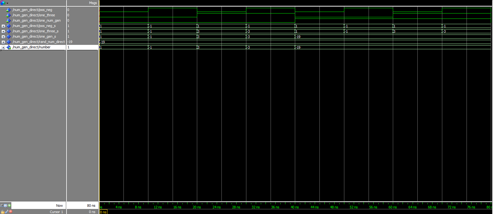

# PSI-3451 Projeto de CI Lógicos Integrados
# Luiz Sol - 8586861
# Experimento 3

A parte prática da aula 4 pretende colocar o aluno em contato com mais algumas estruturas sintáticas da linguagem VHDL, particularmente funções e procedimentos, além de aspectos de bibliotecas externas (IEEE) e construídas pelo usuário.

Tenha certeza que sabe responder as perguntas listadas abaixo após a observação dos arquivos ou dos resultados de simulações.


## PARTE PRÁTICA


São fornecidos 2 arquivos VHDL do módulo `num_gen` que faz parte do projeto **snake**. Cada um contém modelos diferentes dos `muxes` encadeados (ver apostila de conceitos). Cada um dos módulos será modificado durante a aula gerando outros arquivos. No total serão analisados e simulados 5 casos. A seguir vamos descrever cada um dos modelos e os conceitos de VHDL que podem ser observados em cada uma das simulações.

Em cada caso o procedimento para capturar, compilar e simular cada arquivo VHDL é o mesmo utilizado nas aulas anteriores


### Preparação das Pastas e Arquivos para Simulação

* Ligar o computador e entrar no ambiente **Windows**.
* Utilizando o **Windows Explorer** acesse a sua área de trabalho na unidade de rede `X`.
* Na sua área de trabalho crie uma pasta `X:\psi3451\aula_4` para armazenar os resultados desta prática. Como serão realizadas 5 simulações, recomendamos que sejam criadas pastas separadas para cada uma delas com o objetivo de salvar adequadamente os resultados. Por exemplo, crie as pastas:
    1. `X:\psi3451\aula_4\ng_1` (arquivo `num_gen_1.vhd` ; entidade `num_gen_direct`)
    2. Para estudar tipos IEEE e conversões: `X:\psi3451\aula_4\ng_1m` (arquivo `num_gen_1m.vhd` - inicialmente cópia do `num_gen_1` ; entidade `num_gen_direct`).
    3. Para estudar o uso de funções: `X:\psi3451\aula_4\ng_2` (arquivo `num_gen_2.vhd` ; entidade `num_gen_with_function`).
    4. Para estudar o uso de procedimentos: `X:\psi3451\aula_4\ng_3` (arquivo `num_gen_3.vhd` - inicialmente cópia do `num_gen_2`; entidade `num_gen_with_procedure`).
    5. Para estudar o uso de pacotes (**packages**) e bibliotecas (**library**)
        * `X:\psi3451\aula_4\lib_1` (arquivo `procedure_pack.vhd` - inicialmente cópia do `num_gen_3.vhd` ; pacote `procedure_pack`)
        * `X:\psi3451\aula_4\ng_4` (arquivo `num_gen_4.vhd` - inicialmente cópia do `num_gen_2` ; entidade `num_gen_with_procedure_2`).

* No Windows Explorer, selecione **Rede** => **NEWSERVERLAB** => **psi3451** => **aula_4**.
* Copie os arquivos `num_gen_1` e `num_gen_2` para as pastas correspondentes, `X:\psi3451\aula_4\ng_1` e `X:\psi3451\aula_4\ng_2`.


### 1) Captura, compilação e simulação do circuito num_gen_direct (muxes + número direto)

* Abra o arquivo `num_gen_1.vhd` para a pasta `X:\psi3451\aula_4\ng_1`. Ele está codificado no modelo VHDL comportamental (`dataflow`).
* Analise toda a descrição, linha a linha. Tenha certeza que tenha encontrado e entendido cada uma das construções abaixo (conceitos VHDL):
    * o parâmetro `generic width`
    * a inferência dos três muxes (ver apostila de conceitos)
    * pacote `std_logic_1164` (ieee) e tipos `std_logic` e `std_logic_vector`
    * pacote `numeric_std` (ieee) e tipo `signed`/`unsigned`
    * função de conversão `to_unsigned` (`int`, `natural`)
    * type casting `std_logic_vector` (`unsigned`)
    * o local da atribuição de valor por `rand_num_direct` (veja onde você deverá completar os dados)
* Complete ao arquivo `num_gen_1.vhd` com os dados solicitados para o número aleatório (baseados no seu número USP).
* Faça o procedimento de captura, compilação e simulação.

***Recomendação***: realize a simulação para verificar:

* o funcionamento do circuito de acordo com a tabela da apostila de conceitos
* guarde os resultados do Wave para comparação na seção seguinte.

**Pergunta**: seguindo as recomendações, a simulação mostrou o comportamento esperado do circuito como descrito na apostila de conceitos?

> Resposta:
> Código:
```vhdl
LIBRARY IEEE;
USE IEEE.std_logic_1164.all;
USE IEEE.numeric_std.all;


ENTITY num_gen_direct IS
    GENERIC
    (
    WIDTH  : natural := 6
    );

    PORT
    (
    pos_neg     : IN STD_LOGIC;
    one_three   : IN STD_LOGIC;
    one_num_gen : IN STD_LOGIC;
    number      : OUT STD_LOGIC_VECTOR (WIDTH - 1 DOWNTO 0)
    );
END num_gen_direct;


ARCHITECTURE arch OF num_gen_direct IS
--***********************************
--* INTERNAL SIGNAL DECLARATIONS    *
--***********************************
SIGNAL pos_neg_s      : STD_LOGIC_VECTOR (WIDTH - 1 DOWNTO 0);
SIGNAL one_three_s    : STD_LOGIC_VECTOR (WIDTH - 1 DOWNTO 0);
SIGNAL one_gen_s      : STD_LOGIC_VECTOR (WIDTH - 1 DOWNTO 0);
SIGNAL rand_num_direct: UNSIGNED (WIDTH - 1 DOWNTO 0);

BEGIN
    --*******************************
    --*    SIGNAL ASSIGNMENTS        *
    --*******************************

    rand_num_direct <= (to_unsigned(45, number'length));
    --  Meu numero usp, em decimal, eh 8586861
    --  Meu numero usp mod 64, em decimal eh 45

    pos_neg_s <= std_logic_vector (to_unsigned(1, pos_neg_s'length))
                 WHEN (pos_neg = '0')
                 ELSE
                     std_logic_vector (to_signed(-1, pos_neg_s'length))
                     WHEN (pos_neg = '1')
                     ELSE
                         (OTHERS => 'X' );

    one_three_s <= pos_neg_s
                   WHEN (one_three = '0')
                   ELSE
                       pos_neg_s(WIDTH - 1 DOWNTO 2) & (NOT pos_neg_s(1))
                           & pos_neg_s(0)
                       WHEN (one_three = '1')
                       ELSE
                           (OTHERS => 'X' );

    one_gen_s <= one_three_s
                 WHEN (one_num_gen = '0')
                 ELSE
                     std_logic_vector (rand_num_direct)
                     WHEN (one_num_gen = '1')
                     ELSE
                         (OTHERS => 'X' );

    number <= one_gen_s ;

END arch;
```
> Script de compilação e simulação:
```tcl
# Definindo o diretório do projeto
cd X:/projects/cis2/exp03/ng_1
# Criando as libraries do projeto
vlib work
vmap work work
# Compilando o projeto
vcom -reportprogress 300 -work work X:/projects/cis2/exp03/ng_1/num_gen_1.vhd
# Modificando as opções de visualização do projeto
vsim -gui -voptargs=+acc work.num_gen_direct
# Configurando os sinais a serem apresentados
add wave -position insertpoint  \
sim:/num_gen_direct/pos_neg \
sim:/num_gen_direct/one_three \
sim:/num_gen_direct/one_num_gen \
sim:/num_gen_direct/pos_neg_s \
sim:/num_gen_direct/one_three_s \
sim:/num_gen_direct/one_gen_s \
sim:/num_gen_direct/rand_num_direct \
sim:/num_gen_direct/number
# Realizando simulação por 100ns
set meio_periodo 10
force -freeze pos_neg 0 0, 1 $meio_periodo ns -r [expr {2 * $meio_periodo}]
force -freeze one_three 0 0, 1 [expr {2 * $meio_periodo}] ns -r [expr {4 * $meio_periodo}]
force -freeze one_num_gen 0 0, 1 [expr {4 * $meio_periodo}] ns -r [expr {8 * $meio_periodo}]
run [expr {8 * $meio_periodo}]
```
> Resultado da simulação:
> 
>
> Conclusão: o resultado foi o esperado


## 2) Captura, compilação e simulação do circuito `num_gen_direct` no modelo *dataflow*, com alterações de sintaxe

1. Faça uma cópia do arquivo `num_gen_1.vhd` e salve-o com o nome `num_gen_1m.vhd` na pasta `X:\psi3451\aula_3\ng_1m`.
2. Em seguida modifique o arquivo (com o programa Notepad++), COMENTANDO a linha onde se declara o uso do pacote `std_logic_1164`.
3. Faça o procedimento de captura, compilação e simulação.

**Perguntas**: O que ocorreu na compilação? Houve erro? Se positivo, qual foi o erro apontado pelo compilador? Por que?
> Resultado:
> Código fonte:
```vhdl
LIBRARY IEEE;
-- USE IEEE.std_logic_1164.all; Comentário solicitado no exercício
USE IEEE.numeric_std.all;


ENTITY num_gen_direct IS
    GENERIC
    (
    WIDTH  : natural := 6
    );

    PORT
    (
    pos_neg     : IN STD_LOGIC;
    one_three   : IN STD_LOGIC;
    one_num_gen : IN STD_LOGIC;
    number      : OUT STD_LOGIC_VECTOR (WIDTH - 1 DOWNTO 0)
    );
END num_gen_direct;


ARCHITECTURE arch OF num_gen_direct IS
--***********************************
--* INTERNAL SIGNAL DECLARATIONS    *
--***********************************
SIGNAL pos_neg_s      : STD_LOGIC_VECTOR (WIDTH - 1 DOWNTO 0);
SIGNAL one_three_s    : STD_LOGIC_VECTOR (WIDTH - 1 DOWNTO 0);
SIGNAL one_gen_s      : STD_LOGIC_VECTOR (WIDTH - 1 DOWNTO 0);
SIGNAL rand_num_direct: UNSIGNED (WIDTH - 1 DOWNTO 0);

BEGIN
    --*******************************
    --*    SIGNAL ASSIGNMENTS        *
    --*******************************

    rand_num_direct <= (to_unsigned(45, number'length));
    --  Meu numero usp, em decimal, eh 8586861
    --  Meu numero usp mod 64, em decimal eh 45

    pos_neg_s <= std_logic_vector (to_unsigned(1, pos_neg_s'length))
                 WHEN (pos_neg = '0')
                 ELSE
                     std_logic_vector (to_signed(-1, pos_neg_s'length))
                     WHEN (pos_neg = '1')
                     ELSE
                         (OTHERS => 'X' );

    one_three_s <= pos_neg_s
                   WHEN (one_three = '0')
                   ELSE
                       pos_neg_s(WIDTH - 1 DOWNTO 2) & (NOT pos_neg_s(1))
                           & pos_neg_s(0)
                       WHEN (one_three = '1')
                       ELSE
                           (OTHERS => 'X' );

    one_gen_s <= one_three_s
                 WHEN (one_num_gen = '0')
                 ELSE
                     std_logic_vector (rand_num_direct)
                     WHEN (one_num_gen = '1')
                     ELSE
                         (OTHERS => 'X' );

    number <= one_gen_s ;

END arch;
```
> Script de compilação
```tcl
set diretorio "X:/projects/cis2/exp03/ng_1m"
# Definindo o diretório do projeto
cd $diretorio
# Criando as libraries do projeto
vlib work
vmap work work
# Compilando o projeto
vcom -reportprogress 300 -work work $diretorio/num_gen_1m_v1.vhd
# Modificando as opções de visualização do projeto
vsim -gui -voptargs=+acc work.num_gen_direct
# Configurando os sinais a serem apresentados
add wave -position insertpoint  \
sim:/num_gen_direct/pos_neg \
sim:/num_gen_direct/one_three \
sim:/num_gen_direct/one_num_gen \
sim:/num_gen_direct/pos_neg_s \
sim:/num_gen_direct/one_three_s \
sim:/num_gen_direct/one_gen_s \
sim:/num_gen_direct/rand_num_direct \
sim:/num_gen_direct/number
# Realizando simulação por 100ns
set meio_periodo 10
force -freeze pos_neg 0 0, 1 $meio_periodo ns -r [expr {2 * $meio_periodo}]
force -freeze one_three 0 0, 1 [expr {2 * $meio_periodo}] ns -r [expr {4 * $meio_periodo}]
force -freeze one_num_gen 0 0, 1 [expr {4 * $meio_periodo}] ns -r [expr {8 * $meio_periodo}]
run [expr {8 * $meio_periodo}]
```
> Resultado do script de compilação
```
quit -sim
set diretorio "X:/projects/cis2/exp03/ng_1m"
# X:/projects/cis2/exp03/ng_1m
# Definindo o diretório do projeto
cd $diretorio
# reading C:\modeltech64_10.1d\win64/../modelsim.ini
# Criando as libraries do projeto
vlib work
vmap work work
# Copying C:\modeltech64_10.1d\win64/../modelsim.ini to modelsim.ini
# Modifying modelsim.ini
# ** Warning: Copied C:\modeltech64_10.1d\win64/../modelsim.ini to modelsim.ini.
#          Updated modelsim.ini.
# Compilando o projeto
vcom -reportprogress 300 -work work $diretorio/num_gen_1m_v1.vhd
# Model Technology ModelSim SE-64 vcom 10.1d Compiler 2012.11 Nov  1 2012
# -- Loading package STANDARD
# -- Loading package TEXTIO
# -- Loading package std_logic_1164
# -- Loading package NUMERIC_STD
# -- Compiling entity num_gen_direct
# ** Error: X:/projects/cis2/exp03/ng_1m/num_gen_1m_v1.vhd(14): (vcom-1136) Unknown identifier "STD_LOGIC".
#
# ** Error: X:/projects/cis2/exp03/ng_1m/num_gen_1m_v1.vhd(15): (vcom-1136) Unknown identifier "STD_LOGIC".
#
# ** Error: X:/projects/cis2/exp03/ng_1m/num_gen_1m_v1.vhd(16): (vcom-1136) Unknown identifier "STD_LOGIC".
#
# ** Error: X:/projects/cis2/exp03/ng_1m/num_gen_1m_v1.vhd(17): (vcom-1136) Unknown identifier "STD_LOGIC_VECTOR".
#
# ** Error: X:/projects/cis2/exp03/ng_1m/num_gen_1m_v1.vhd(19): VHDL Compiler exiting
# C:/modeltech64_10.1d/win64/vcom failed.
```
> Comentário: Não foi possível realizar a compilação pois o compilador não coisaguiu resolver os nomes `STD_LOGIC` e `STD_LOGIC_VECTOR`


4. Partindo novamente do arquivo `num_gen_1.vhd` (**ATENÇÃO**: antes de ser modificado) repita os itens *i*, *ii* e *iii* fazendo as modificações listadas a seguir (uma de cada vez) e responda sempre a mesma pergunta acima.
    * **COMENTAR** a linha onde se declara o pacote `numeric_std`
    * **SUBSTITUIR** a linha

        ```vhdl
        rand_num_direct <= (to_unsigned (YOUR_NUMBER_DECIMAL, number'length));
        ```
        por
        ```vhdl
        rand_num_direct <= YOUR_NUMBER_DECIMAL;
        ```


    * **SUBSTITUIR** a linha
        ```vhdl
        rand_num_direct <= (to_unsigned (YOUR_NUMBER_DECIMAL, number'length));
        ```
        por
        ```vhdl
        rand_num_direct <= "YOUR_NUMBER_BINARY ";
        ```

    * Na linha de comando de atribuição de `one_gen_s` **SUBSTITUIR**
        ```vhdl
        std_logic_vector (rand_num_direct)
        ```
        por
        ```vhdl
        rand_num_direct
        ```

***Recomendação***: Realize uma simulação com a mesma sequência de estímulos adotada na Seção 1.

> Resultado:
> Código fonte:
```vhdl
LIBRARY IEEE;
USE IEEE.std_logic_1164.all;
--USE IEEE.numeric_std.all;


ENTITY num_gen_direct IS
    GENERIC
    (
    WIDTH  : natural := 6
    );

    PORT
    (
    pos_neg     : IN STD_LOGIC;
    one_three   : IN STD_LOGIC;
    one_num_gen : IN STD_LOGIC;
    number      : OUT STD_LOGIC_VECTOR (WIDTH - 1 DOWNTO 0)
    );
END num_gen_direct;


ARCHITECTURE arch OF num_gen_direct IS
--***********************************
--* INTERNAL SIGNAL DECLARATIONS    *
--***********************************
SIGNAL pos_neg_s      : STD_LOGIC_VECTOR (WIDTH - 1 DOWNTO 0);
SIGNAL one_three_s    : STD_LOGIC_VECTOR (WIDTH - 1 DOWNTO 0);
SIGNAL one_gen_s      : STD_LOGIC_VECTOR (WIDTH - 1 DOWNTO 0);
SIGNAL rand_num_direct: UNSIGNED (WIDTH - 1 DOWNTO 0);

BEGIN
    --*******************************
    --*    SIGNAL ASSIGNMENTS        *
    --*******************************

    rand_num_direct <= "00101101";
    --  Meu numero usp, em decimal, eh 8586861
    --  Meu numero usp mod 64, em decimal eh 45

    pos_neg_s <= std_logic_vector (to_unsigned(1, pos_neg_s'length))
                 WHEN (pos_neg = '0')
                 ELSE
                     std_logic_vector (to_signed(-1, pos_neg_s'length))
                     WHEN (pos_neg = '1')
                     ELSE
                         (OTHERS => 'X' );

    one_three_s <= pos_neg_s
                   WHEN (one_three = '0')
                   ELSE
                       pos_neg_s(WIDTH - 1 DOWNTO 2) & (NOT pos_neg_s(1))
                           & pos_neg_s(0)
                       WHEN (one_three = '1')
                       ELSE
                           (OTHERS => 'X' );

    one_gen_s <= one_three_s
                 WHEN (one_num_gen = '0')
                 ELSE
                     rand_num_direct
                     WHEN (one_num_gen = '1')
                     ELSE
                         (OTHERS => 'X' );

    number <= one_gen_s ;

END arch;
```
> Script de compilação:
```tcl
# Saindo de uma possível simulação anterior
quit -sim
# Definindo variáveis da compilação e simulação
set diretorio "X:/projects/cis2/exp03/ng_1m"
set arquivo "num_gen_1m_v2.vhd"
set componente "num_gen_direct"
set meio_periodo 10
# Definindo o diretório do projeto
cd $diretorio
# Criando as libraries do projeto
vlib work
vmap work work
# Compilando o projeto
vcom -reportprogress 300 -work work $diretorio/$arquivo
# Modificando as opções de visualização do projeto
vsim -gui -voptargs=+acc work.$componente
# Configurando os sinais a serem apresentados
add wave -position insertpoint  \
sim:/$componente/pos_neg \
sim:/$componente/one_three \
sim:/$componente/one_num_gen \
sim:/$componente/pos_neg_s \
sim:/$componente/one_three_s \
sim:/$componente/one_gen_s \
sim:/$componente/rand_num_direct \
sim:/$componente/number
# Realizando simulação por 100ns
force -freeze pos_neg 0 0, 1 $meio_periodo ns -r [expr {2 * $meio_periodo}]
force -freeze one_three 0 0, 1 [expr {2 * $meio_periodo}] ns -r [expr {4 * $meio_periodo}]
force -freeze one_num_gen 0 0, 1 [expr {4 * $meio_periodo}] ns -r [expr {8 * $meio_periodo}]
run [expr {8 * $meio_periodo}]
```
> Resultado da compilação:
```
# Saindo de uma possível simulação anterior
quit -sim
# Definindo variáveis da compilação e simulação
set diretorio "X:/projects/cis2/exp03/ng_1m"
# X:/projects/cis2/exp03/ng_1m
set arquivo "num_gen_1m_v2.vhd"
# num_gen_1m_v2.vhd
set componente "num_gen_direct"
# num_gen_direct
set meio_periodo 10
# 10
# Definindo o diretório do projeto
cd $diretorio
# reading modelsim.ini
# Criando as libraries do projeto
vlib work
# ** Warning: (vlib-34) Library already exists at "work".
#
vmap work work
# Modifying modelsim.ini
# Compilando o projeto
vcom -reportprogress 300 -work work $diretorio/$arquivo
# Model Technology ModelSim SE-64 vcom 10.1d Compiler 2012.11 Nov  1 2012
# -- Loading package STANDARD
# -- Loading package TEXTIO
# -- Loading package std_logic_1164
# -- Compiling entity num_gen_direct
# -- Compiling architecture arch of num_gen_direct
# ** Error: X:/projects/cis2/exp03/ng_1m/num_gen_1m_v2.vhd(29): (vcom-1136) Unknown identifier "UNSIGNED".
#
# ** Error: X:/projects/cis2/exp03/ng_1m/num_gen_1m_v2.vhd(40): (vcom-1136) Unknown identifier "to_unsigned".
#
# ** Error: X:/projects/cis2/exp03/ng_1m/num_gen_1m_v2.vhd(43): (vcom-1136) Unknown identifier "to_signed".
#
# ** Error: X:/projects/cis2/exp03/ng_1m/num_gen_1m_v2.vhd(67): VHDL Compiler exiting
# C:/modeltech64_10.1d/win64/vcom failed.
```
> Não foi possível compilar o projeto devido à não importação das bibliotecas que definem alguns tipos e funções declarados no código.

## 3) Captura, compilação e simulação do circuito `num_gen_2` (muxes + função)

Funções devem ser vistas como estruturas que objetivam estruturar a descrição do modelo e aumentar a legibilidade do VHDL. Há uma forte semelhança entre funções da linguagem VHDL com as existentes em linguagens de programação de software como C ou Pascal. __Não deve ser confundido__ com componentes que são representações estruturais de módulos.

Como características principais, as funções:

* retornam um valor;
* são chamadas dentro de expressões;
* não modificam valores que lhe são passados;
* são executados em um ciclo de simulação, ou seja, todos os parâmetros passados são vistos como variáveis.

1. Abra o arquivo `num_gen_2.vhd` para a pasta `X:\psi3451\aula_4\ng_2`.
2. Analise toda a descrição, linha a linha. Tenha certeza que tenha encontrado e entendido os itens seguintes:
    * o parâmetros `generic width`
    * a inferência dos três muxes __como ilustrado na apostila de conceitos__
    * a declaração de função `rand_num_f` (veja onde você deverá completar os dados)
    * o corpo da função
    * a chamada de função
    * a declaração de atraso inercial
3. Complete ao arquivo `num_gen_2.vhd` com os dados solicitados para a função (baseados no seu número USP)
4. Faça o procedimento de captura, compilação e simulação

Recomendação: realize a simulação para verificar:

    * o funcionamento do circuito de acordo com a tabela da apostila de conceitos
    * Guarde os resultados do Wave para comparação na seção seguinte.

**Perguntas**: seguindo as recomendações, a simulação mostrou o comportamento esperado do circuito como descrito na apostila de conceitos? O tempo de atraso especificado foi observado na simulação?

> Terminar...
