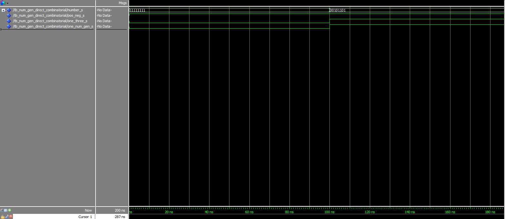
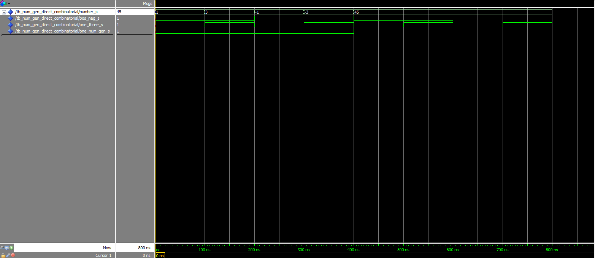
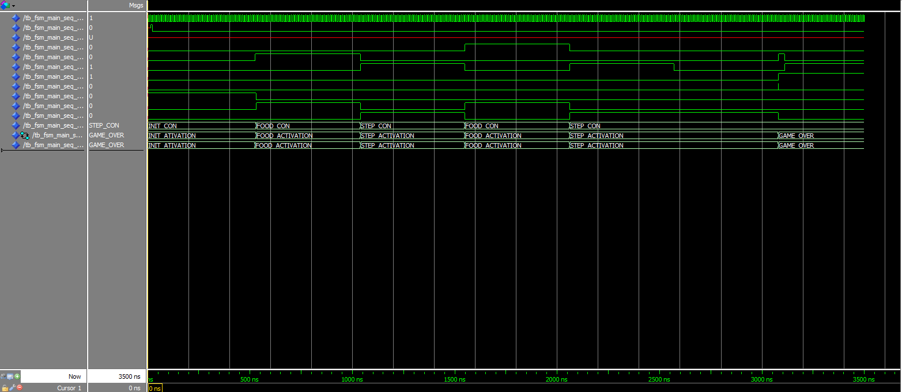

# PSI-3451 Projeto de CI Lógicos Integrados
# Luiz Sol - 8586861
# Experimento 4

## 1) Captura, compilação e simulação do testbench para o circuito combinacional.

Recomendação para a simulação:

* adicione os sinais desejado para a janela Wave e rode a simulação por um tempo compatível com os tempos de wait do stimuli_module.
* observe que você não precisará gerar estímulos para as entrada através do comando force
* após a primeira rodada, adicione mais vetores de teste (chamadas do procedure) para testar todas as condições de entrada.
* Guarde os resultados do Wave para futuras referências e comparações.

***Perguntas***: você conseguiu verificar todas as opções de controle do módulo num_gen_direct? Seguindo as recomendações, a simulação mostrou o comportamento esperado do testbench como descrito na apostila de conceitos? Como você compara o uso do testbench com o uso do arquivo `*.tcl` feito até o momento?

Simulando o circuito na sua forma original

Estrutura da pasta:
```
comb
|-- num_gen_1.vhd
|-- script_compilacao.tcl
|-- stimuli_comb.vhd
`-- testbench_comb.vhd
```

Script de compilação:

```tcl
# Saindo de uma possível simulação anterior
quit -sim
# Definindo variáveis da compilação e simulação
set diretorio "X:/projects/cis2/exp04/comb"
set arquivo1 "num_gen_1.vhd"
set arquivo2 "stimuli_comb.vhd"
set arquivo3 "testbench_comb.vhd"
set componente1 "num_gen_direct"
set componente2 "stimuli_module"
set componente3 "tb_num_gen_direct_combinatorial"
set duration [expr {2 * 100}]
# Definindo o diretório do projeto
cd $diretorio
# Criando as libraries do projeto
vlib work
vmap work work
# Compilando o projeto
vcom -reportprogress 300 -work work $diretorio/$arquivo1
vcom -reportprogress 300 -work work $diretorio/$arquivo2
vcom -reportprogress 300 -work work $diretorio/$arquivo3
# Modificando as opções de visualização do projeto
vsim -gui -voptargs=+acc work.$componente3
view wave
# Configurando os sinais a serem apresentados
add wave -position insertpoint sim:/$componente3/*
run $duration ns
```

Resultado da simulação




Alterando o arquivo `stimuli_comb.vhd` para adicionar mais vetores de simulação:
```vhdl
library ieee;
use ieee.std_logic_1164.all;
use ieee.numeric_std.all;

entity stimuli_module is
    generic
    (
    WIDTH   : natural := 6
    );

    port
    (
    pos_neg         : out STD_LOGIC;
    one_three           : out STD_LOGIC;
    one_num_gen     : out STD_LOGIC;
    number          : in STD_LOGIC_VECTOR (WIDTH-1 downto 0)
    );

end stimuli_module ;

architecture test of stimuli_module  is
-- "Time" that will elapse between test vectors we submit to the component.
constant TIME_DELTA : time := 100 ns;

signal  pos_neg_s       :  STD_LOGIC_VECTOR (0 downto 0);
signal  one_three_s :  STD_LOGIC_VECTOR (0 downto 0);


begin

pos_neg <= pos_neg_s(0);
one_three <= one_three_s (0);

simulation : process

-- procedure for vector generation

procedure check_num_gen(constant a, b: in INTEGER; c : in STD_LOGIC) is
begin
-- Assign values to estimuli_module´s outputs.
pos_neg_s <= std_logic_vector(to_unsigned(a,1));
one_three_s <= std_logic_vector(to_unsigned(b,1));
one_num_gen <= c;


wait for TIME_DELTA;
end procedure check_num_gen;

begin

-- test vectors application

check_num_gen(0, 0, '0');
check_num_gen(0, 1, '0');
check_num_gen(1, 0, '0');
check_num_gen(1, 1, '0');
check_num_gen(0, 0, '1');
check_num_gen(0, 1, '1');
check_num_gen(1, 0, '1');
check_num_gen(1, 1, '1');

wait;
end process simulation;
end architecture test;
```

Novo script de compilação:

```tcl
# Saindo de uma possível simulação anterior
quit -sim
# Definindo variáveis da compilação e simulação
set diretorio "X:/projects/cis2/exp04/comb"
set arquivo1 "num_gen_1.vhd"
set arquivo2 "stimuli_comb.vhd"
set arquivo3 "testbench_comb.vhd"
set componente1 "num_gen_direct"
set componente2 "stimuli_module"
set componente3 "tb_num_gen_direct_combinatorial"
set duration [expr {8 * 100}]
# Definindo o diretório do projeto
cd $diretorio
# Criando as libraries do projeto
vlib work
vmap work work
# Compilando o projeto
vcom -reportprogress 300 -work work $diretorio/$arquivo1
vcom -reportprogress 300 -work work $diretorio/$arquivo2
vcom -reportprogress 300 -work work $diretorio/$arquivo3
# Modificando as opções de visualização do projeto
vsim -gui -voptargs=+acc work.$componente3
view wave
# Configurando os sinais a serem apresentados
add wave -position insertpoint sim:/$componente3/*
run $duration ns
```

Resultado da nova simulação:


***Respostas***:
> você conseguiu verificar todas as opções de controle do módulo num_gen_direct?

Sim.

> Seguindo as recomendações, a simulação mostrou o comportamento esperado do testbench como descrito na apostila de conceitos?

Sim.

> Como você compara o uso do testbench com o uso do arquivo `*.tcl` feito até o momento?

Mais simples, uma vez que essa arquitetura compartimenta os estímulos dos testes em um arquivo *vhd* e a lógica de compilação no arquivo *tcl*, deixando ambos mais claros e organizados.

## 2) Captura, compilação e simulação do testbench para o primeiro circuito sequencial.

Recomendação para a simulação:

* observe que você não precisará gerar estímulos para as entrada através do comando force
* adicione os sinais desejado para a janela Wave e rode a simulação. Atenção especial para a inserção e observação dos sinais de estado do módulo fsm_main_simplificado para se certificar da correta transição de estados.
* após a primeira rodada, modifique livremente o seu código para testar outras transições de estado possíveis e demais condições de entrada para verificar os efeitos.
* Guarde os resultados do Wave para futuras referências e comparações.

***Perguntas***: Conseguiu verificar a passagem por todos os estados? Você conseguiu verificar todas as opções de controle do módulo fsm_main_simplificado? Seguindo as recomendações, a simulação mostrou o comportamento esperado do testbench como descrito na apostila de conceitos?

Simulando o circuito na sua forma original

Estrutura da pasta:
```
comb
|-- clock_generator.vhd
|-- fsm_main_1.vhd
|-- script_compilacao.tcl
|-- stimuli_seq_1.vhd
`-- testbench_seq_1.vhd
```

Script de compilação:

```tcl
# Saindo de uma possível simulação anterior
quit -sim
# Definindo variáveis da compilação e simulação
set diretorio "X:/projects/cis2/exp04/seq_1"

set arquivo1 "fsm_main_1.vhd"
set componente1 "fsm_main_simplificado"

set arquivo2 "clock_generator.vhd"
set componente2 "clock_generator"

set arquivo3 "stimuli_seq_1.vhd"
set componente3 "stimuli_seq_1"

set arquivo4 "testbench_seq_1.vhd"
set componente4 "tb_fsm_main_seq_1"

set duration [expr {350 * 10}]
# Definindo o diretório do projeto
cd $diretorio
# Criando as libraries do projeto
vlib work
vmap work work
# Compilando o projeto
vcom -reportprogress 300 -work work $diretorio/$arquivo1
vcom -reportprogress 300 -work work $diretorio/$arquivo2
vcom -reportprogress 300 -work work $diretorio/$arquivo3
vcom -reportprogress 300 -work work $diretorio/$arquivo4
# Modificando as opções de visualização do projeto
vsim -gui -voptargs=+acc work.$componente4
view wave
# Configurando os sinais a serem apresentados
add wave -position insertpoint sim:/$componente4/*
add wave -position insertpoint sim:/$componente4/dut/STATE
add wave -position insertpoint sim:/$componente4/dut/NEXT_STATE
run $duration ns
```

Resultado da simulação



***Respostas***:
> Conseguiu verificar a passagem por todos os estados?

Sim.

> Você conseguiu verificar todas as opções de controle do módulo fsm_main_simplificado?

Sim.

> Seguindo as recomendações, a simulação mostrou o comportamento esperado do testbench como descrito na apostila de conceitos?

Sim.


## 3) Captura e simulação do da máquina fsm_main no modelo comportamental com a inserção do estado IDLE

Resultado:
Estrutura da pasta:
```
comb
|-- clock_generator.vhd
|-- fsm_main_2.vhd
|-- script_compilacao.tcl
|-- stimuli_seq_2.vhd
`-- testbench_seq_2.vhd
```

Script de compilação:

```tcl
# Saindo de uma possível simulação anterior
quit -sim
# Definindo variáveis da compilação e simulação
set diretorio "X:/projects/cis2/exp04/seq_2"

set arquivo1 "fsm_main_2.vhd"
set componente1 "fsm_main"

set arquivo2 "clock_generator.vhd"
set componente2 "clock_generator"

set arquivo3 "stimuli_seq_2.vhd"
set componente3 "stimuli_seq_2"

set arquivo4 "testbench_seq_2.vhd"
set componente4 "tb_fsm_main_seq_2"

set duration [expr {350 * 10}]
# Definindo o diretório do projeto
cd $diretorio
# Criando as libraries do projeto
vlib work
vmap work work
# Compilando o projeto
vcom -reportprogress 300 -work work $diretorio/$arquivo1
vcom -reportprogress 300 -work work $diretorio/$arquivo2
vcom -reportprogress 300 -work work $diretorio/$arquivo3
vcom -reportprogress 300 -work work $diretorio/$arquivo4
# Modificando as opções de visualização do projeto
vsim -gui -voptargs=+acc work.$componente4
view wave
# Configurando os sinais a serem apresentados
add wave -position insertpoint sim:/$componente4/*
add wave -position insertpoint sim:/$componente4/dut/STATE
add wave -position insertpoint sim:/$componente4/dut/NEXT_STATE
run $duration ns
```


Novo código (`fsm_main_2.vhd`):
```vhdl
-------------------------------------------------------------------------------
--
-- Title       : No Title
-- Design      : Snake
-- Author      : C1-53A
-- Company     : Hewlett-Packard Company
--
-------------------------------------------------------------------------------
--
-- File        : C:\Users\C1-53A\Google Drive\Uni\USP\Projeto_Wang\Project\Snake\Snake\compile\fsm_main.vhd
-- Generated   : 11/10/16 12:44:24
-- From        : C:\Users\C1-53A\Google Drive\Uni\USP\Projeto_Wang\Project\Snake\Snake\src\fsm_main.asf
-- By          : FSM2VHDL ver. 5.0.7.2
--
-------------------------------------------------------------------------------
--
-- Description :
--
-------------------------------------------------------------------------------
package my_package is

type CONTROL_SELECT is
    (
    INIT_CON,
    FOOD_CON,
    STEP_CON
    );


end package;


library IEEE;
use IEEE.std_logic_1164.all;
use IEEE.std_logic_arith.all;
use IEEE.std_logic_unsigned.all;
use work.my_package.all;


entity fsm_main is
    port
    (
    clk             : in STD_LOGIC;         --from system
    res             : in STD_LOGIC;         --from system
    cnt_rdy         : in STD_LOGIC;         --from system
    cmp_food_flag   : in STD_LOGIC;         --from datapath/comparator module
    fsm_i_done      : in STD_LOGIC;         --from fsm_init
    fsm_f_done      : in STD_LOGIC;         --from fsm_food_spawn
    fsm_s_done      : in STD_LOGIC;         --from fsm_step
    fsm_s_game_over : in STD_LOGIC;         --from fsm_step
    con_sel         : out CONTROL_SELECT;   --to internal
    fsm_i_start     : out STD_LOGIC;        --to fsm_init
    fsm_f_start     : out STD_LOGIC;        --to fsm_food
    fsm_s_start     : out STD_LOGIC         --to fsm_start
    );
end fsm_main;

architecture arch of fsm_main is


-- SYMBOLIC ENCODED FSM STATES
type STATE_TYPE_MAIN is (
    INIT_ATIVATION, FOOD_ACTIVATION, IDLE, STEP_ACTIVATION, GAME_OVER
);

signal STATE, NEXT_STATE: STATE_TYPE_MAIN;

-- Declarations of pre-registered internal signals

begin

------------------------------------
-- Next to Current State Logic (sequential)
------------------------------------
upd_state:  process (clk)
                begin
                    if clk'event and clk = '1' then
                        if(res = '1')   then
                            STATE <= INIT_ATIVATION;
                        else
                            STATE <= NEXT_STATE;
                        end if;
                    end if;
                end process;


------------------------------------
-- Next State Logic (combinatorial)
------------------------------------

upd_next_state: process (cnt_rdy, cmp_food_flag, fsm_i_done, fsm_f_done, fsm_s_done, fsm_s_game_over, STATE)
begin
    case STATE is
        when INIT_ATIVATION =>
            if(fsm_i_done = '1') then
                NEXT_STATE <= FOOD_ACTIVATION;
            else
                NEXT_STATE <= INIT_ATIVATION;
            end if;

        when FOOD_ACTIVATION =>
            if(fsm_f_done = '1') then
                NEXT_STATE <= IDLE;
            else
                NEXT_STATE <= FOOD_ACTIVATION;
            end if;

        when IDLE =>
            if(cnt_rdy = '1') then
                NEXT_STATE <= STEP_ACTIVATION;
            else
                NEXT_STATE <= IDLE;
            end if;

        when STEP_ACTIVATION =>
            if (fsm_s_game_over = '1') then
                NEXT_STATE <= GAME_OVER;
            elsif(cmp_food_flag = '1') then -- fsm_s_game_over = 0
                NEXT_STATE <= FOOD_ACTIVATION;
            elsif(fsm_s_done = '1') then -- fsm_s_game_over = 0 && cmp_food_flag = 0
                NEXT_STATE <= IDLE;
            else
                NEXT_STATE <= STEP_ACTIVATION;
            end if;

        when GAME_OVER =>
            NEXT_STATE <= GAME_OVER;

        when others =>
            null;

    end case;
end process;


------------------------------------
-- OUTPUT Logic (combinatorial)
------------------------------------
upd_output: process (STATE)
begin
    case STATE is
        when INIT_ATIVATION =>
            con_sel <= INIT_CON;
            fsm_i_start <= '1';
            fsm_f_start <= '0';
            fsm_s_start <= '0';

        when FOOD_ACTIVATION =>
            con_sel <= FOOD_CON;
            fsm_i_start <= '0';
            fsm_f_start <= '1';
            fsm_s_start <= '0';

        when IDLE =>
            con_sel <= STEP_CON;
            fsm_i_start <= '0';
            fsm_f_start <= '0';
            fsm_s_start <= '0';

        when STEP_ACTIVATION =>
            con_sel <= STEP_CON;
            fsm_i_start <= '0';
            fsm_f_start <= '0';
            fsm_s_start <= '1';

        when GAME_OVER  =>
            con_sel <= STEP_CON;
            fsm_i_start <= '0';
            fsm_f_start <= '0';
            fsm_s_start <= '0';

        when others =>
            null;

    end case;
end process;

end arch;
```

## 4) Modificação de Testbench para `fsm_main`

***Perguntas***: Conseguiu verificar a passagem pelo novo estado IDLE e as suas transições? Seguindo as recomendações, a simulação mostrou o comportamento esperado do testbench como descrito na apostila de conceitos?
