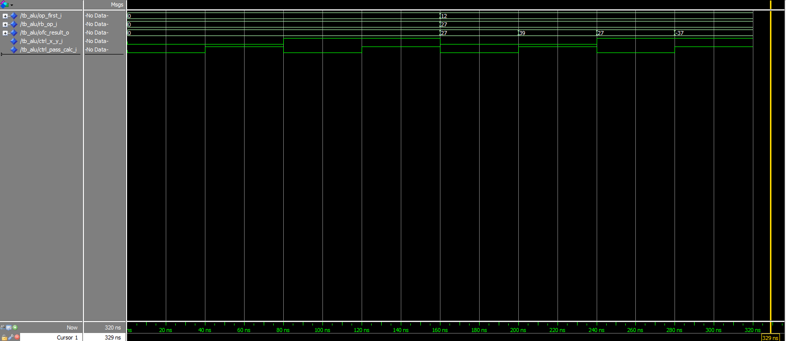
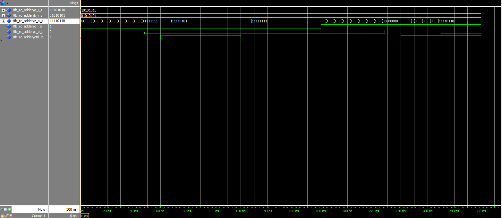

# PSI-3451 Projeto de CI Lógicos Integrados

# Luiz Sol - 8586861

# Experimento 5

## 1) Captura, compilação e simulação do somador ripple_carry no modelo estrutural

**Perguntas**: todas as entidades aparecem na biblioteca work?

* Faça a simulação da entidade `testbench_rc_adder` (cf. descrito em exemplos trabalhados na práticas anteriores).

**Recomendação**: adicione estímulos ao testbench e sinais internos no Wave a fim de para verificar:

* o funcionamento do ripple carry adder
* teste casos de propagação de carry-out e de overflow

Guarde os resultados do Wave para futuras referências e comparações.

**Perguntas**: seguindo as recomendações, a simulação mostrou o comportamento esperado do circuito como descrito na apostila de conceitos? É o mesmo resultado da simulação do item 5) da Aula 2?

**Resultados**:

Layout da pasta:
```
rca_2
|-- full_adder_1.vhd
|-- rc_adder_2.vhd
|-- script_compilacao.tcl
|-- stimuli_rc_adder.vhd
`-- testbench_rc_adder.vhd
```

`stimuli_rc_adder.vhd`:
```vhdl
library ieee;
use ieee.std_logic_1164.all;
use ieee.numeric_std.all;

entity stimuli_module is
  generic
  (
  WIDTH: natural := 32
  );

  port
  (
  a_i, b_i: out STD_LOGIC_VECTOR(WIDTH-1 downto 0);
  c_i:out STD_LOGIC
  );
end stimuli_module ;

architecture test of stimuli_module  is
-- "Time" that will elapse between test vectors we submit to the component.
constant TIME_DELTA : time := 40 ns;      -- choose any value


begin

simulation : process

-- procedure for vector generation

procedure assign_input_words(constant a, b: in integer) is
begin
-- Assign values to estimuli_module´s outputs.
a_i <= std_logic_vector(to_unsigned(a,WIDTH));
b_i <= std_logic_vector(to_unsigned(b,WIDTH));

wait for TIME_DELTA;
end procedure assign_input_words;


procedure assign_carry_in (constant a: in STD_LOGIC) is
begin
-- Assign values to estimuli_module´s outputs.
c_i <= a;

-- wait for TIME_DELTA;
end procedure assign_carry_in;

begin

-- test vectors application

assign_carry_in('0');
assign_input_words(50, 40);

assign_carry_in('0');
assign_input_words(150, 150);

assign_carry_in('1');
assign_input_words(255, 255);

wait;
end process simulation;
end architecture test;
```

`script_compilacao.tcl`:
```tcl
# Saindo de uma possível simulação anterior
quit -sim
# Definindo variáveis da compilação e simulação
set diretorio "X:/projects/cis2/exp05/rca_2"

set arquivos {"full_adder_1.vhd" "rc_adder_2.vhd" "stimuli_rc_adder.vhd" "testbench_rc_adder.vhd"}

set componente "tb_rc_adder"

set duration [expr {40 * 3}]
# Definindo o diretório do projeto
cd $diretorio
# Criando as libraries do projeto
vlib work
vmap work work
# Compilando o projeto
[foreach arquivo $arquivos {
    vcom -reportprogress 300 -work work $diretorio/$arquivo
}]

# Modificando as opções de visualização do projeto
vsim -gui -voptargs=+acc work.$componente
view wave
# Configurando os sinais a serem apresentados
add wave -position insertpoint sim:/$componente/*
add wave -position insertpoint sim:/$componente/dut/cout_s
run $duration ns
```

Resultado da simulação:


> todas as entidades aparecem na biblioteca work?

Sim, todas as entidades apareceram na biblioteca `work`.

> seguindo as recomendações, a simulação mostrou o comportamento esperado do circuito como descrito na apostila de conceitos?

Sim.

> É o mesmo resultado da simulação do item 5) da Aula 2?

Sim.

### 2) Captura, compilação e simulação da unidade lógica aritmética

**Perguntas**: seguindo as recomendações, a simulação mostrou o comportamento esperado do circuito como descrito na apostila de conceitos?

**Resultados**:

```bash
alu_1
|-- alu_1.vhd
|-- full_adder_1.vhd
|-- rc_adder_2.vhd
|-- script_compilacao.tcl
|-- stimuli_alu.vhd
`-- testbench_alu.vhd
```

`script_compilacao.tcl`:

```tcl
# Saindo de uma possível simulação anterior
quit -sim
# Definindo variáveis da compilação e simulação
set diretorio "X:/projects/cis2/exp05/alu_1"

set arquivos {"full_adder_1.vhd" "rc_adder_2.vhd" "alu_1.vhd" "stimuli_alu.vhd" "testbench_alu.vhd"}

set componente "tb_alu"

set duration [expr {40 * 8}]
# Definindo o diretório do projeto
cd $diretorio
# Criando as libraries do projeto
vlib work
vmap work work
# Compilando o projeto
[foreach arquivo $arquivos {
    vcom -reportprogress 300 -work work $diretorio/$arquivo
}]

# Modificando as opções de visualização do projeto
vsim -gui -voptargs=+acc work.$componente
view wave
# Configurando os sinais a serem apresentados
add wave -position insertpoint sim:/$componente/*
# add wave -position insertpoint sim:/$componente/dut/cout_s
run $duration ns
```

`stimuli_alu.vhd`:
```vhdl
library ieee;
use ieee.std_logic_1164.all;
use ieee.numeric_std.all;

entity stimuli_module is
  generic
  (
  WIDTH: natural := 8
  );

  port
  (
  op_first:       out STD_LOGIC_VECTOR(WIDTH - 1 downto 0);
  rb_op:          out STD_LOGIC_VECTOR(WIDTH - 1 downto 0);
  ctrl_x_y:       out STD_LOGIC;
  ctrl_pass_calc: out STD_LOGIC
  );

end stimuli_module;

architecture test of stimuli_module  is
-- "Time" that will elapse between test vectors we submit to the component.
constant TIME_DELTA : time := 40 ns;      -- choose any value

begin

simulation : process

-- procedure for vector generation

procedure assign_input_words (constant a, b: in integer) is
begin
-- Assign values to estimuli_module´s outputs.
op_first <= std_logic_vector(to_unsigned(a, WIDTH));
rb_op <= std_logic_vector(to_unsigned(b, WIDTH));

wait for TIME_DELTA;
end procedure assign_input_words;


procedure assign_ctrl_x_y (constant a: in STD_LOGIC) is
begin
-- Assign values to estimuli_module´s outputs.
ctrl_x_y <= a;

-- wait for TIME_DELTA;
end procedure assign_ctrl_x_y;

procedure assign_ctrl_pass_calc (constant a: in STD_LOGIC) is
begin
-- Assign values to estimuli_module´s outputs.
ctrl_pass_calc <= a;

-- wait for TIME_DELTA;
end procedure assign_ctrl_pass_calc;

begin

-- test vectors application

assign_ctrl_x_y('0');
assign_ctrl_pass_calc('0');
assign_input_words(0, 0);

assign_ctrl_x_y('0');
assign_ctrl_pass_calc('1');
assign_input_words(0, 0);

assign_ctrl_x_y('1');
assign_ctrl_pass_calc('0');
assign_input_words(0, 0);

assign_ctrl_x_y('1');
assign_ctrl_pass_calc('1');
assign_input_words(0, 0);

assign_ctrl_x_y('0');
assign_ctrl_pass_calc('0');
assign_input_words(12, 27);

assign_ctrl_x_y('0');
assign_ctrl_pass_calc('1');
assign_input_words(12, 27);

assign_ctrl_x_y('1');
assign_ctrl_pass_calc('0');
assign_input_words(12, 27);

assign_ctrl_x_y('1');
assign_ctrl_pass_calc('1');
assign_input_words(12, 27);


wait;
end process simulation;
end architecture test;
```

`testbench_alu.vhd`:

```vhdl
library ieee;
use ieee.std_logic_1164.all;
use ieee.numeric_std.all;

entity tb_alu is

GENERIC (WIDTH: natural := 8);

end tb_alu;

architecture test of tb_alu is

component stimuli_module
  generic
  (
  WIDTH: natural := 8
  );

  port
  (
    op_first:       out STD_LOGIC_VECTOR(WIDTH - 1 downto 0);
    rb_op:          out STD_LOGIC_VECTOR(WIDTH - 1 downto 0);
    ctrl_x_y:       out STD_LOGIC;
    ctrl_pass_calc: out STD_LOGIC
  );
end component ;

component alu
  generic
  (
  WIDTH    : NATURAL  := 8
  );

  port
  (
  op_first:       in STD_LOGIC_VECTOR(WIDTH-1 downto 0);
  rb_op:          in STD_LOGIC_VECTOR(WIDTH-1 downto 0);
  ctrl_x_y:       in STD_LOGIC;
  ctrl_pass_calc: in STD_LOGIC;
  ofc_result:     out STD_LOGIC_VECTOR(WIDTH-1 downto 0)
  );
end component ;

  signal op_first_i, rb_op_i, ofc_result_o: STD_LOGIC_VECTOR(WIDTH-1 downto 0);
  signal ctrl_x_y_i, ctrl_pass_calc_i : STD_LOGIC;

begin

-- Instantiate DUT
  dut : alu
    generic map(WIDTH => WIDTH)
    port map(
      op_first => op_first_i,
      rb_op => rb_op_i,
      ctrl_x_y => ctrl_x_y_i,
      ctrl_pass_calc => ctrl_pass_calc_i,
      ofc_result => ofc_result_o
    );

-- Instantiate test module
  test : stimuli_module
    generic map(WIDTH => WIDTH)
    port map(
      op_first => op_first_i,
      rb_op => rb_op_i,
      ctrl_x_y => ctrl_x_y_i,
      ctrl_pass_calc => ctrl_pass_calc_i
    );


end architecture test;
```

Resultado da simulação:



> seguindo as recomendações, a simulação mostrou o comportamento esperado do circuito como descrito na apostila de conceitos?

Sim.

## 3) Captura, compilação e simulação do somador `ripple_carry` no modelo estrutural (atividade com `generate`)

**Perguntas**: seguindo as recomendações, a simulação mostrou o comportamento esperado do circuito como descrito na apostila de conceitos? Verificou comportamento semelhante ao do conjunto rc_adder e shifter da seção 1?

**Resultados**:

```bash
rca_3
|-- full_adder_1.vhd
|-- rc_adder_3.vhd
|-- script_compilacao.tcl
|-- stimuli_adder.vhd
`-- testbench_adder.vhd
```

`rc_adder.vhd`:

```vhdl
Library IEEE;
use ieee.STD_LOGIC_1164.all;

entity rc_adder_3 is
  generic
  (
    WIDTH : integer := 32
  );

  port
  (
    a_i, b_i: in STD_LOGIC_VECTOR(WIDTH - 1 downto 0);
    c_i:      in STD_LOGIC;
    z_o:      out STD_LOGIC_VECTOR(WIDTH - 1 downto 0);
    c_o:      out STD_LOGIC;
    ctrl_x_y: in STD_LOGIC
  );

end rc_adder_3;

architecture arch of rc_adder_3 is

  component full_adder_1
    port
    (
      a_in:  in STD_LOGIC;
      b_in:  in STD_LOGIC;
      c_in:  in STD_LOGIC;
      z_out: out STD_LOGIC;
      c_out: out STD_LOGIC
    );
  end component;

  signal cout_s: STD_LOGIC_VECTOR(WIDTH - 1 downto 0);
  signal z_s: STD_LOGIC_VECTOR(WIDTH - 1 downto 0);
  signal a_aux_s: STD_LOGIC_VECTOR(WIDTH - 1 downto 0);

begin

    fa_init:  full_adder_1 port map
                (
                  a_in => a_aux_s(0),
                  b_in => b_i(0),
                  c_in => c_i,
                  z_out => z_s(0),
                  c_out => cout_s(0)
                );

    a_aux_s(0) <= a_i(0) when (ctrl_x_y = '0')
                         else
                           '0' when (ctrl_x_y = '1')
                               else
                                 'X';

  gen_fas: for I in 1 to WIDTH - 2 generate

    gen_fas_if_1:
        if (I < WIDTH / 2) GENERATE
          a_aux_s(I) <= a_i(I) when (ctrl_x_y = '0')
                               else
                                 '0' when (ctrl_x_y = '1')
                                     else
                                       'X';
        END GENERATE gen_fas_if_1;

    gen_fas_if_2:
        if (I >= WIDTH / 2) GENERATE
          a_aux_s(I) <= a_i(I) when (ctrl_x_y = '0')
                               else
                                 a_i(I - (WIDTH / 2)) when (ctrl_x_y = '1')
                                                      else
                                                        'X';
        END GENERATE gen_fas_if_2;

    fa: full_adder_1 port map
            (
              a_in => a_aux_s(i),
              b_in => b_i(i),
              c_in => cout_s(i - 1),
              z_out => z_s(i),
              c_out => cout_s(i)
            );
  end generate;

  fa_last:  full_adder_1 port map
              (
                a_in => a_aux_s(WIDTH - 1),
                b_in => b_i(WIDTH - 1),
                c_in => cout_s(WIDTH-2),
                z_out => z_s(WIDTH - 1),
                c_out => cout_s(WIDTH - 1)
              );

    a_aux_s(WIDTH - 1) <= a_i(WIDTH - 1) when (ctrl_x_y = '0')
                                         else
                                           a_i((WIDTH / 2) - 1) when (ctrl_x_y = '1')
                                                                else
                                                                  'X';

     z_o <= z_s;
     c_o <= cout_s(WIDTH - 1);

end arch;
```

`script_compilacao.tcl`:

```tcl
# Saindo de uma possível simulação anterior
quit -sim
# Definindo variáveis da compilação e simulação
set diretorio "X:/projects/cis2/exp05/rca_3"

set arquivos {"full_adder_1.vhd" "rc_adder_3.vhd" "stimuli_rc_adder.vhd" "testbench_rc_adder.vhd"}

set componente "tb_rc_adder"

set duration [expr {60 * 5}]
# Definindo o diretório do projeto
cd $diretorio
# Criando as libraries do projeto
vlib work
vmap work work
# Compilando o projeto
[foreach arquivo $arquivos {
    vcom -reportprogress 300 -work work $diretorio/$arquivo
}]

# Modificando as opções de visualização do projeto
vsim -gui -voptargs=+acc work.$componente
view wave
# Configurando os sinais a serem apresentados
add wave -position insertpoint sim:/$componente/*
# add wave -position insertpoint sim:/$componente/dut/cout_s
run $duration ns
```

`stimuli_rc_adder.vhd`:

```vhdl
library ieee;
use ieee.std_logic_1164.all;
use ieee.numeric_std.all;

entity stimuli_module is
  generic
  (
    WIDTH: natural := 32
  );

  port
  (
    a_i, b_i: out STD_LOGIC_VECTOR(WIDTH-1 downto 0);
    c_i:      out STD_LOGIC;
    ctrl_x_y: out STD_LOGIC
  );
end stimuli_module ;

architecture test of stimuli_module  is
-- "Time" that will elapse between test vectors we submit to the component.
constant TIME_DELTA : time := 60 ns;      -- choose any value

begin

simulation : process

-- procedure for vector generation

procedure assign_input_words(constant a, b: in integer) is
begin
-- Assign values to estimuli_module´s outputs.
  a_i <= std_logic_vector(to_unsigned(a,WIDTH));
  b_i <= std_logic_vector(to_unsigned(b,WIDTH));

wait for TIME_DELTA;
end procedure assign_input_words;


procedure assign_carry_in (constant a: in STD_LOGIC) is
begin
-- Assign values to estimuli_module´s outputs.
  c_i <= a;
  -- wait for TIME_DELTA;
end procedure assign_carry_in;

procedure assign_ctrl_x_y (constant a: in STD_LOGIC) is
begin
-- Assign values to estimuli_module´s outputs.
  ctrl_x_y <= a;
  -- wait for TIME_DELTA;
end procedure assign_ctrl_x_y;

begin
  -- test vectors application

  assign_carry_in('0');
  assign_ctrl_x_y('0');
  assign_input_words(170, 85);

  assign_carry_in('0');
  assign_ctrl_x_y('1');
  assign_input_words(170, 85);

  assign_carry_in('0');
  assign_ctrl_x_y('0');
  assign_input_words(170, 85);

  assign_carry_in('1');
  assign_ctrl_x_y('0');
  assign_input_words(170, 85);

  assign_carry_in('1');
  assign_ctrl_x_y('1');
  assign_input_words(170, 85);

  wait;
end process simulation;
end architecture test;
```

`testbench_rc_adder.vhd`:

```vhdl
library ieee;
use ieee.std_logic_1164.all;
use ieee.numeric_std.all;

entity tb_rc_adder is

GENERIC (WIDTH: natural :=8);

end tb_rc_adder;

architecture test of tb_rc_adder is

component stimuli_module
  generic
  (
    WIDTH: natural := 32
  );

  port
  (
    a_i, b_i: out STD_LOGIC_VECTOR(WIDTH-1 downto 0);
    c_i:      out STD_LOGIC;
    ctrl_x_y: out STD_LOGIC
  );
end component ;

component rc_adder_3
  generic
  (
    WIDTH : integer := 32
  );

  port
  (
    a_i, b_i: in STD_LOGIC_VECTOR(WIDTH - 1 downto 0);
    c_i:      in STD_LOGIC;
    z_o:      out STD_LOGIC_VECTOR(WIDTH - 1 downto 0);
    c_o:      out STD_LOGIC;
    ctrl_x_y: in STD_LOGIC
  );
end component ;

  signal a_i_s, b_i_s, z_o_s : STD_LOGIC_VECTOR(WIDTH-1 downto 0);
  signal c_i_s, c_o_s, ctrl_x_y_s : STD_LOGIC;

begin

-- Instantiate DUT
  dut : rc_adder_3
    generic map(WIDTH => WIDTH)
    port map(
      a_i => a_i_s,
      b_i => b_i_s,
      c_i => c_i_s,
      z_o => z_o_s,
      c_o => c_o_s,
      ctrl_x_y => ctrl_x_y_s
    );

-- Instantiate test module
  test : stimuli_module
    generic map(WIDTH => WIDTH)
    port map(
      a_i => a_i_s,
      b_i => b_i_s,
      c_i => c_i_s,
      ctrl_x_y => ctrl_x_y_s
    );


end architecture test;
```

Resultado da simulação:



> seguindo as recomendações, a simulação mostrou o comportamento esperado do circuito como descrito na apostila de conceitos?

Sim.

> Verificou comportamento semelhante ao do conjunto rc_adder e shifter da seção 1?

Sim.
