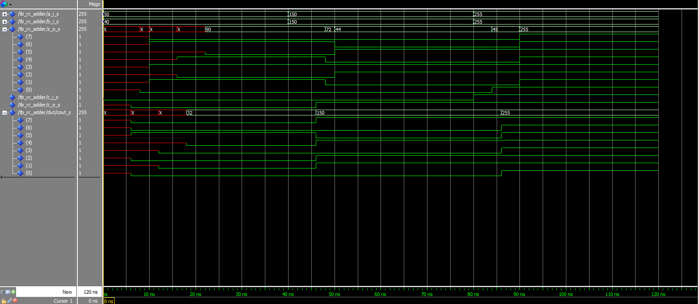

# PSI-3451 Projeto de CI Lógicos Integrados

# Luiz Sol - 8586861

# Experimento 5

## 1) Captura, compilação e simulação do somador ripple_carry no modelo estrutural

**Perguntas**: todas as entidades aparecem na biblioteca work?

* Faça a simulação da entidade `testbench_rc_adder` (cf. descrito em exemplos trabalhados na práticas anteriores).

**Recomendação**: adicione estímulos ao testbench e sinais internos no Wave a fim de para verificar:

* o funcionamento do ripple carry adder
* teste casos de propagação de carry-out e de overflow

Guarde os resultados do Wave para futuras referências e comparações.

**Perguntas**: seguindo as recomendações, a simulação mostrou o comportamento esperado do circuito como descrito na apostila de conceitos? É o mesmo resultado da simulação do item 5) da Aula 2?

**Resultados**:

Layout da pasta:
```
rca_2
|-- full_adder_1.vhd
|-- rc_adder_2.vhd
|-- script_compilacao.tcl
|-- stimuli_rx_adder.vhd
|-- testbench_rc_adder.vhd
```

`stimuli_rc_adder.vhd`:
```vhdl
library ieee;
use ieee.std_logic_1164.all;
use ieee.numeric_std.all;

entity stimuli_module is
  generic
  (
  WIDTH: natural := 32
  );

  port
  (
  a_i, b_i: out STD_LOGIC_VECTOR(WIDTH-1 downto 0);
  c_i:out STD_LOGIC
  );
end stimuli_module ;

architecture test of stimuli_module  is
-- "Time" that will elapse between test vectors we submit to the component.
constant TIME_DELTA : time := 40 ns;      -- choose any value


begin

simulation : process

-- procedure for vector generation

procedure assign_input_words(constant a, b: in integer) is
begin
-- Assign values to estimuli_module´s outputs.
a_i <= std_logic_vector(to_unsigned(a,WIDTH));
b_i <= std_logic_vector(to_unsigned(b,WIDTH));

wait for TIME_DELTA;
end procedure assign_input_words;


procedure assign_carry_in (constant a: in STD_LOGIC) is
begin
-- Assign values to estimuli_module´s outputs.
c_i <= a;

-- wait for TIME_DELTA;
end procedure assign_carry_in;

begin

-- test vectors application

assign_carry_in('0');
assign_input_words(50, 40);

assign_carry_in('0');
assign_input_words(150, 150);

assign_carry_in('1');
assign_input_words(255, 255);

wait;
end process simulation;
end architecture test;
```

`script_compilacao.tcl`:
```tcl
# Saindo de uma possível simulação anterior
quit -sim
# Definindo variáveis da compilação e simulação
set diretorio "X:/projects/cis2/exp05/rca_2"

set arquivos {"full_adder_1.vhd" "rc_adder_2.vhd" "stimuli_rc_adder.vhd" "testbench_rc_adder.vhd"}

set componente "tb_rc_adder"

set duration [expr {40 * 3}]
# Definindo o diretório do projeto
cd $diretorio
# Criando as libraries do projeto
vlib work
vmap work work
# Compilando o projeto
[foreach arquivo $arquivos {
    vcom -reportprogress 300 -work work $diretorio/$arquivo
}]

# Modificando as opções de visualização do projeto
vsim -gui -voptargs=+acc work.$componente
view wave
# Configurando os sinais a serem apresentados
add wave -position insertpoint sim:/$componente/*
add wave -position insertpoint sim:/$componente/dut/cout_s
run $duration ns
```

Resultado da simulação:



> todas as entidades aparecem na biblioteca work?

Sim, todas as entidades apareceram na biblioteca `work`.

> seguindo as recomendações, a simulação mostrou o comportamento esperado do circuito como descrito na apostila de conceitos?

Sim.

> É o mesmo resultado da simulação do item 5) da Aula 2?

Sim.

### 2) Captura, compilação e simulação da unidade lógica aritmética
