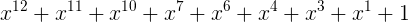
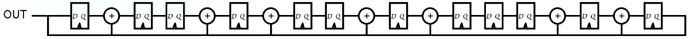
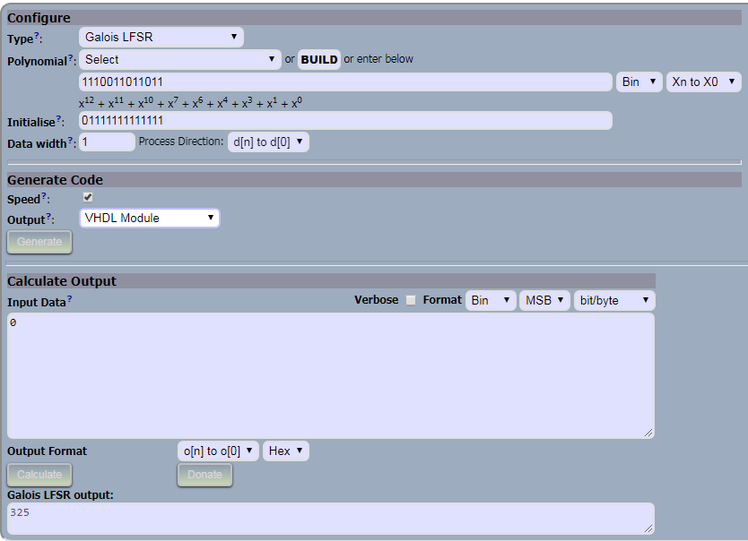
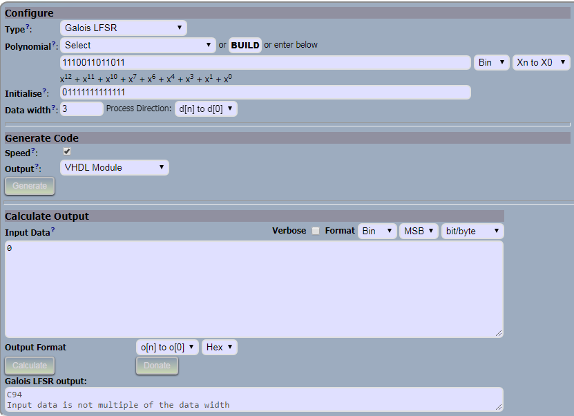
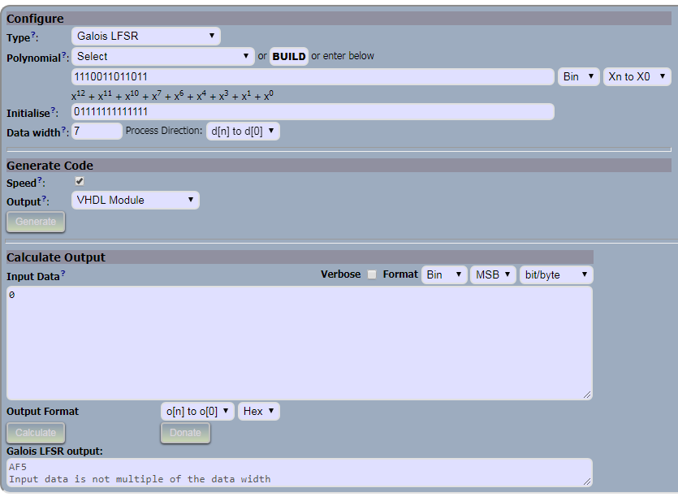

# PSI-3451 Projeto de CI Lógicos Integrados

Luiz Sol - 8586861

## Experimento 6 - Implementação do LFSR

> o aluno deve apresentar o polinômio, explicando como chegou à configuração

`NUSP = 8586861`

`8586861 % 2048 = 1645 = 0b11001101101`

O que resultará no polinômio:



> apresentar um esboço (em forma digital ou manuscrito) do esquema do circuito LFSR desenvolvido.



> impressão das imagens de tela com os resultados da simulação (10 ciclos).









foi gerada a seguinte sequência:

| Data width | Galois LFSR Output |
|------------|--------------------|
| 1          | 325                |
| 2          | 64A                |
| 3          | C94                |
| 4          | 5F3                |
| 5          | BE6                |
| 6          | B17                |
| 7          | AF5                |
| 8          | 931                |
| 9          | EB9                |
| 10         | 1A9                |

> incluir a descrição do projeto em VHDL.

O site gerou o seguinte VHDL:

```vhdl
--    /*  -------------------------------------------------------------------------

--    This program is free software: you can redistribute it and/or modify
--    it under the terms of the GNU General Public License as published by
--    the Free Software Foundation, either version 3 of the License, or
--    any later version.
--
--    This program is distributed in the hope that it will be useful,
--    but WITHOUT ANY WARRANTY; without even the implied warranty of
--    MERCHANTABILITY or FITNESS FOR A PARTICULAR PURPOSE.  See the
--    GNU General Public License for more details.
--
--    You should have received a copy of the GNU General Public License
--    along with this program.  If not, see <http://www.gnu.org/licenses/>.
--
--    Copyright: Levent Ozturk crc@leventozturk.com
--    https://leventozturk.com/engineering/crc/
--    Polynomial: x12+x11+x10+x7+x6+x4+x3+x1+1
--    d0 is the first data processed

--    c is internal LFSR state and the CRC output. Not needed for other modules than CRC.
--    c width is always same as polynomial width.
--    o is the output of all modules except CRC. Not needed for CRC.
--    o width is always same as data width width
-------------------------------------------------------------------------*/

library ieee;
use ieee.std_logic_1164.all;
use ieee.numeric_std.all;

entity glfsr_1_1110011011011 is generic (
  SEED : in std_ulogic_vector( 11 downto 0) := b"111111111111"
); port (
  clk : in std_ulogic;
  reset : in std_ulogic;
  fd : in std_ulogic;
  nd : in std_ulogic;
  rdy : out std_ulogic;
  d : in std_ulogic_vector(  0 downto 0);
  c : out std_ulogic_vector( 11 downto 0);
  o : out std_ulogic_vector(  0 downto 0)
); end glfsr_1_1110011011011;

architecture a1 of glfsr_1_1110011011011 is
  signal                       nd_q : std_ulogic;
  signal                       fd_q : std_ulogic;
  signal                       dq : std_ulogic_vector ( 11 downto 0);
  signal                       ca : std_ulogic_vector( 11 downto 0);
  signal                       oa : std_ulogic_vector(  0 downto 0);
begin
  process (clk)
  begin
    if (rising_edge(clk)) then
      nd_q <= nd;
      fd_q <= fd;
      dq(  0) <= '0';
      dq(  1) <= '0';
      dq(  2) <= '0';
      dq(  3) <= '0';
      dq(  4) <= '0';
      dq(  5) <= '0';
      dq(  6) <= '0';
      dq(  7) <= '0';
      dq(  8) <= '0';
      dq(  9) <= '0';
      dq( 10) <= '0';
      dq( 11) <= '0';

    end if;
  end process;

  process (clk, reset)
  begin
    if (reset= '1') then
      ca <= SEED;
      rdy <= '0';
    elsif (rising_edge(clk)) then
      rdy <= nd_q;
      if(nd_q= '1') then
        if (fd_q= '1') then
          ca(  0) <= SEED( 11) xor dq(  0);
          ca(  1) <= SEED(  0) xor SEED( 11) xor dq(  1);
          ca(  2) <= SEED(  1) xor dq(  2);
          ca(  3) <= SEED(  2) xor SEED( 11) xor dq(  3);
          ca(  4) <= SEED(  3) xor SEED( 11) xor dq(  4);
          ca(  5) <= SEED(  4) xor dq(  5);
          ca(  6) <= SEED(  5) xor SEED( 11) xor dq(  6);
          ca(  7) <= SEED(  6) xor SEED( 11) xor dq(  7);
          ca(  8) <= SEED(  7) xor dq(  8);
          ca(  9) <= SEED(  8) xor dq(  9);
          ca( 10) <= SEED(  9) xor SEED( 11) xor dq( 10);
          ca( 11) <= SEED( 10) xor SEED( 11) xor dq( 11);


          oa(  0) <= SEED( 11) xor dq(  0);
        else
          ca(  0) <= ca( 11) xor dq(  0);
          ca(  1) <= ca(  0) xor ca( 11) xor dq(  1);
          ca(  2) <= ca(  1) xor dq(  2);
          ca(  3) <= ca(  2) xor ca( 11) xor dq(  3);
          ca(  4) <= ca(  3) xor ca( 11) xor dq(  4);
          ca(  5) <= ca(  4) xor dq(  5);
          ca(  6) <= ca(  5) xor ca( 11) xor dq(  6);
          ca(  7) <= ca(  6) xor ca( 11) xor dq(  7);
          ca(  8) <= ca(  7) xor dq(  8);
          ca(  9) <= ca(  8) xor dq(  9);
          ca( 10) <= ca(  9) xor ca( 11) xor dq( 10);
          ca( 11) <= ca( 10) xor ca( 11) xor dq( 11);

          oa(  0) <= ca( 11) xor dq(  0);
        end if;
      end if;
    end if;
  end process;
  c <= ca;
  o <= oa;
end a1;
```
